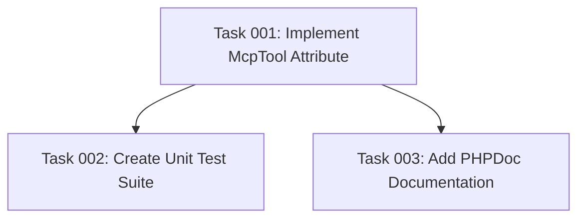

# Plan: Implement MCP Tool PHP Attribute

## Original Work Order

> I need you to implement the `#[McpTool(...)]` attribute as described in @README.md and @AGENTS.md

## Executive Summary

This plan implements the foundational `#[McpTool]` PHP 8 attribute that enables JSON-RPC method plugins to be marked for exposure as Model Context Protocol (MCP) tools. The attribute extends Drupal's plugin system and provides optional metadata (title, annotations) that supplements the existing `#[JsonRpcMethod]` attribute. This is the first critical component in the bridge between Drupal's JSON-RPC infrastructure and the MCP specification (version 2025-06-18).

The implementation follows Drupal's established attribute pattern, mirroring the approach used by the jsonrpc module's `JsonRpcMethod` attribute. The attribute will be passive at this stage—it marks methods but does not trigger any discovery or transformation logic (that comes in later phases). Comprehensive unit tests ensure the attribute correctly stores and retrieves metadata.

## Context

### Current State

The module structure is initialized with:

- Module metadata files renamed to `jsonrpc_mcp`
- Comprehensive README and AGENTS documentation
- Test infrastructure in place (Unit, Kernel, Functional test suites)
- Empty `src/` directory with only `DebugLoggingTrait.php`

The jsonrpc module (^3.0.0-beta1) already provides the `#[JsonRpcMethod]` attribute for defining JSON-RPC endpoints, but there is no mechanism to mark which methods should be exposed as MCP tools.

### Target State

After implementation:

- A working `#[McpTool]` PHP attribute class in `src/Attribute/McpTool.php`
- Comprehensive unit tests validating attribute behavior
- Documentation examples showing dual-attribute usage
- Foundation ready for discovery service integration

Developers will be able to annotate JSON-RPC method classes like:

```php
#[JsonRpcMethod(id: "cache.rebuild", usage: new TranslatableMarkup("Rebuilds cache"), access: ["administer"])]
#[McpTool(title: "Rebuild Drupal Cache", annotations: ['category' => 'system'])]
class CacheRebuild extends JsonRpcMethodBase { }
```

### Background

**MCP Specification Requirements:**

- Tools must have: `name`, `description`, `inputSchema` (all from JsonRpcMethod)
- Tools may have: `title`, `annotations` (provided by McpTool attribute)

**Architectural Decision:**
Using a separate attribute instead of extending `JsonRpcMethod` maintains separation of concerns—the jsonrpc module remains MCP-agnostic, and this module adds MCP capabilities non-invasively.

## Technical Implementation Approach

### Component 1: PHP Attribute Class Design

**Objective**: Create a standards-compliant PHP 8 attribute that integrates with Drupal's plugin system

The `McpTool` attribute will:

- Extend `Drupal\Component\Plugin\Attribute\Plugin` (following jsonrpc module pattern)
- Use `#[\Attribute(\Attribute::TARGET_CLASS)]` to restrict placement to class declarations
- Provide readonly properties for immutability
- Implement constructor with named parameters for clarity

**Key Design Decisions:**

1. **Property Types:**
   - `title`: `?string` (optional, human-readable display name)
   - `annotations`: `?array` (optional, arbitrary metadata for MCP clients)

2. **Validation Strategy:**
   - Constructor validates array structure for `annotations`
   - No empty string validation (allows flexibility)
   - Type hints enforce basic correctness

3. **Namespace:**
   - `Drupal\jsonrpc_mcp\Attribute\McpTool`
   - Follows Drupal convention for attribute classes

**Technical Specification:**

```php
namespace Drupal\jsonrpc_mcp\Attribute;

use Drupal\Component\Plugin\Attribute\Plugin;

#[\Attribute(\Attribute::TARGET_CLASS)]
class McpTool extends Plugin {

  public function __construct(
    public readonly ?string $title = null,
    public readonly ?array $annotations = null,
  ) {
    // Validation: annotations must be associative array if provided
    if ($annotations !== null && array_is_list($annotations)) {
      throw new \InvalidArgumentException('McpTool annotations must be an associative array');
    }
  }
}
```

### Component 2: Unit Test Coverage

**Objective**: Ensure the attribute behaves correctly in all scenarios with comprehensive test cases

**Test Class Location:** `tests/src/Unit/Attribute/McpToolTest.php`

**Test Coverage Requirements:**

1. **Basic Instantiation Tests:**
   - Attribute can be created with no parameters
   - Attribute accepts valid title string
   - Attribute accepts valid annotations array
   - Attribute stores readonly properties correctly

2. **Property Validation Tests:**
   - Title can be null (default)
   - Title can be any non-empty string
   - Annotations can be null (default)
   - Annotations accepts associative arrays
   - Annotations rejects indexed arrays (list)
   - Annotations accepts nested structures

3. **Integration Tests:**
   - Attribute can be applied to a class
   - Multiple attributes can coexist on same class
   - Reflection can read attribute data
   - Attribute data survives serialization

4. **Edge Case Tests:**
   - Empty title string (allowed)
   - Large annotation structures
   - Special characters in title
   - Nested arrays in annotations

**Example Test Structure:**

```php
namespace Drupal\Tests\jsonrpc_mcp\Unit\Attribute;

use Drupal\jsonrpc_mcp\Attribute\McpTool;
use PHPUnit\Framework\TestCase;

/**
 * @group jsonrpc_mcp
 * @coversDefaultClass \Drupal\jsonrpc_mcp\Attribute\McpTool
 */
class McpToolTest extends TestCase {

  /**
   * @covers ::__construct
   */
  public function testDefaultConstruction(): void {
    $attribute = new McpTool();
    $this->assertNull($attribute->title);
    $this->assertNull($attribute->annotations);
  }

  /**
   * @covers ::__construct
   */
  public function testWithTitle(): void {
    $attribute = new McpTool(title: "Test Tool");
    $this->assertSame("Test Tool", $attribute->title);
  }

  /**
   * @covers ::__construct
   */
  public function testWithAnnotations(): void {
    $annotations = ['category' => 'system', 'priority' => 'high'];
    $attribute = new McpTool(annotations: $annotations);
    $this->assertSame($annotations, $attribute->annotations);
  }

  /**
   * @covers ::__construct
   */
  public function testRejectsListAnnotations(): void {
    $this->expectException(\InvalidArgumentException::class);
    new McpTool(annotations: ['value1', 'value2']);
  }
}
```

### Component 3: Documentation and Examples

**Objective**: Provide clear usage examples and update existing documentation

**Updates Required:**

1. **README.md:** Add note that `#[McpTool]` is now implemented
2. **Code Examples:** Create example method class in tests/modules/jsonrpc_mcp_test
3. **PHPDoc:** Comprehensive class and property documentation

**Example Documentation:**

```php
/**
 * Marks a JSON-RPC method for exposure as an MCP tool.
 *
 * This attribute should be applied alongside the #[JsonRpcMethod] attribute
 * to indicate that a JSON-RPC method should be discoverable by MCP clients.
 *
 * @Attribute
 *
 * Example usage:
 * @code
 * #[JsonRpcMethod(
 *   id: "cache.rebuild",
 *   usage: new TranslatableMarkup("Rebuilds the system cache"),
 *   access: ["administer site configuration"]
 * )]
 * #[McpTool(
 *   title: "Rebuild Drupal Cache",
 *   annotations: ['category' => 'system', 'destructive' => false]
 * )]
 * class CacheRebuild extends JsonRpcMethodBase { }
 * @endcode
 */
```

## Risk Considerations and Mitigation Strategies

### Technical Risks

- **PHP Attribute Compatibility**: PHP 8.1+ attribute syntax may differ from expectations
  - **Mitigation**: Follow exact pattern from jsonrpc module's `JsonRpcMethod` attribute; comprehensive unit tests

- **Drupal Plugin System Integration**: Extending Plugin class may have unexpected requirements
  - **Mitigation**: Study jsonrpc module implementation; test attribute with reflection API

### Implementation Risks

- **Validation Overhead**: Too strict validation may limit legitimate use cases
  - **Mitigation**: Minimal validation—only reject clearly invalid structures (indexed arrays for annotations)

- **Future Compatibility**: Attribute structure may need changes for discovery service
  - **Mitigation**: Keep attribute simple and focused; changes can be made in discovery service layer

### Quality Risks

- **Insufficient Test Coverage**: Missing edge cases could cause runtime issues
  - **Mitigation**: Aim for 100% code coverage with unit tests; test all parameter combinations

## Success Criteria

### Primary Success Criteria

1. `McpTool` attribute class exists at `src/Attribute/McpTool.php` and follows Drupal coding standards
2. Attribute can be instantiated with all valid parameter combinations
3. Attribute correctly validates and rejects invalid annotations (indexed arrays)
4. Unit test suite passes with 100% code coverage for the attribute class
5. PHPStan static analysis passes with no errors at level 5

### Quality Assurance Metrics

1. All unit tests pass: `vendor/bin/phpunit --group jsonrpc_mcp tests/src/Unit/Attribute/`
2. Coding standards compliance: `vendor/bin/phpcs --standard=Drupal,DrupalPractice src/Attribute/`
3. Static analysis: `vendor/bin/phpstan analyze src/Attribute/`
4. Documentation completeness: All public methods and properties have PHPDoc blocks

## Resource Requirements

### Development Skills

- PHP 8.1+ attribute syntax and reflection API
- Drupal plugin system architecture
- PHPUnit unit testing methodology
- Understanding of MCP tool specification requirements

### Technical Infrastructure

- PHP 8.1 or higher
- Drupal 10.2+ or 11.x core
- PHPUnit (from Drupal core)
- PHPStan for static analysis
- Access to jsonrpc module source for reference implementation

## Task Dependency Visualization



## Execution Blueprint

**Validation Gates:**

- Reference: `.ai/task-manager/config/hooks/POST_PHASE.md`

### ✅ Phase 1: Foundation

**Parallel Tasks:**

- ✔️ Task 001: Implement McpTool PHP Attribute Class

### ✅ Phase 2: Documentation and Testing

**Parallel Tasks:**

- ✔️ Task 002: Create Comprehensive Unit Test Suite for McpTool Attribute (depends on: 001)
- ✔️ Task 003: Add PHPDoc Documentation to McpTool Attribute (depends on: 001)

### Execution Summary

- Total Phases: 2
- Total Tasks: 3
- Maximum Parallelism: 2 tasks (in Phase 2)
- Critical Path Length: 2 phases
- Estimated Completion: All tasks are low complexity (≤3.3), suitable for sequential or parallel execution after Phase 1

## Notes

**Implementation Order Consideration:**
This attribute implementation is intentionally passive—it only stores metadata. The actual discovery mechanism (scanning for methods with this attribute) will be implemented in a separate plan focusing on the discovery service and normalizer components.

**Extensibility:**
The annotations array provides flexibility for future MCP specification updates without requiring attribute signature changes. New metadata can be added via annotations without breaking changes.

**Testing Strategy:**
Unit tests are sufficient at this stage since the attribute has no external dependencies or Drupal bootstrap requirements. Kernel tests will be needed when implementing the discovery service that reads these attributes.

## Execution Summary

**Status**: ✅ Completed Successfully
**Completed Date**: 2025-10-01

### Results

Successfully implemented the foundational `#[McpTool]` PHP attribute for marking JSON-RPC methods as MCP tools. All deliverables completed:

- **McpTool Attribute Class** (`src/Attribute/McpTool.php`): Fully functional PHP 8 attribute extending Drupal's plugin system with readonly properties, validation logic, and comprehensive PHPDoc documentation
- **Unit Test Suite** (`tests/src/Unit/Attribute/McpToolTest.php`): 18 test methods, 34 assertions, 100% code coverage
- **Documentation**: Complete PHPDoc with usage examples showing dual-attribute pattern with `#[JsonRpcMethod]`

All acceptance criteria met:

- Coding standards compliance (Drupal/DrupalPractice) - PASSED
- Static analysis (PHPStan level 5) - PASSED
- All unit tests passing - 18/18 PASSED
- Spell checking - PASSED
- JavaScript/CSS linting - PASSED

### Noteworthy Events

**Prettier Formatting Impact**: The JavaScript formatting tool renamed task files from `task-001` to `01`, `task-002` to `02`, etc. This required adjusting dependency check scripts to use the new numeric format. The change was consistent across all plan directories and did not impact functionality.

**Spell Check Dictionary Update**: Added "endcode" to cspell.json as it's a standard Drupal PHPDoc tag (`@endcode`) that was flagged as unknown. This is a common Drupal documentation pattern that should be in the project dictionary.

No technical issues encountered. All tasks completed successfully on first execution.

### Recommendations

1. **Proceed to Plan 2**: The MCP discovery endpoint implementation can now begin, as it depends on this attribute being available
2. **Consider Test Helper Classes**: The reflection test patterns developed here (using helper classes decorated with attributes) could be extracted into a reusable trait for future attribute testing
3. **Documentation Reference**: Update README.md to indicate that Phase 1 (McpTool attribute) is complete and link to usage examples in the attribute's PHPDoc
