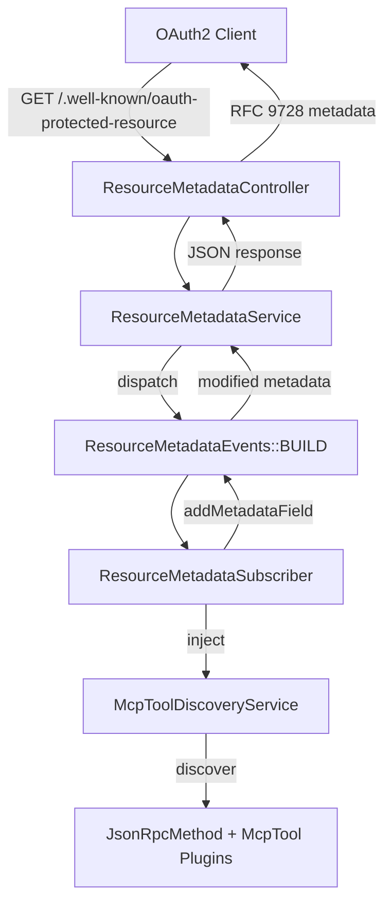
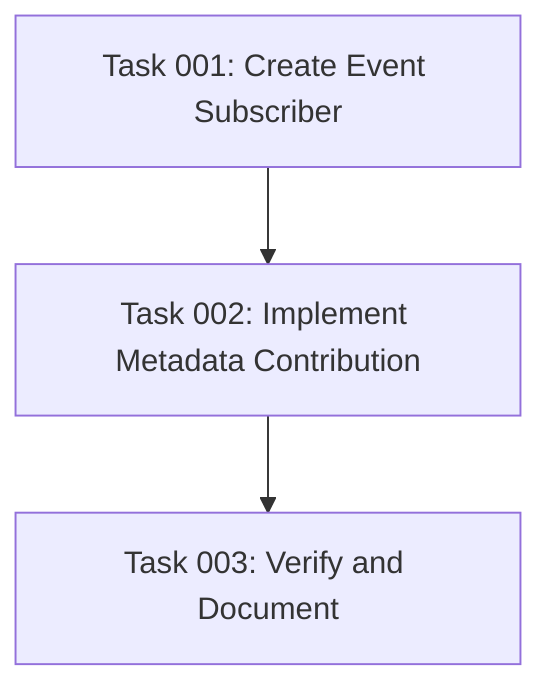

# Plan: OAuth 2.0 Protected Resource Metadata Integration for MCP Tools

## Original Work Order

> we recently added one route per tool. Additionally, the ../simple_oauth_21 module introduced the ResourceMetadataEvents.
>
> I want you to enhance the resource metadata with the information from both the #[JsonRpcMethod] and #[McpTool]. Research the RFC for the official attributes that we can provide with the available metadata. Use tools and think harder.

## Executive Summary

This plan implements integration between the jsonrpc_mcp module's per-tool routes and the simple_oauth_21 module's RFC 9728 OAuth 2.0 Protected Resource Metadata event system. By subscribing to `ResourceMetadataEvents::BUILD`, the module will dynamically contribute tool-specific metadata fields that inform OAuth2 clients about available MCP tools, their authentication requirements, and authorization scopes.

The implementation aligns with both RFC 9728 (OAuth 2.0 Protected Resource Metadata) and the Model Context Protocol specification's authorization requirements. This enables OAuth2 clients to discover MCP tool capabilities, required scopes, and bearer token methods through standardized metadata endpoints, facilitating proper authentication flows and scope negotiation.

The integration leverages existing metadata from `#[JsonRpcMethod]` and `#[McpTool]` attributes to populate RFC 9728-compliant fields, ensuring MCP tools are properly advertised in the OAuth2 resource metadata discovery workflow.

## Context

### Current State

The jsonrpc_mcp module currently:
- Generates per-tool invocation routes (`/mcp/tools/{tool_name}`)
- Supports OAuth2 Bearer token authentication with scope validation
- Stores auth metadata in route defaults (`_mcp_auth_level`, `_mcp_auth_scopes`)
- Implements MCP tool discovery via `McpToolDiscoveryService`
- Uses `#[JsonRpcMethod]` and `#[McpTool]` attributes for metadata

The simple_oauth_21 module provides:
- RFC 9728-compliant resource metadata endpoint
- `ResourceMetadataEvents::BUILD` event for metadata contribution
- `ResourceMetadataEvent` with helper methods (`addMetadataField()`, etc.)
- `ResourceMetadataService` that dispatches events during metadata generation

**Current limitation**: MCP tool information is not exposed through OAuth2 resource metadata, preventing proper OAuth2 client discovery of tool capabilities and required scopes.

### Target State

After implementation:
- MCP tool metadata is contributed to OAuth2 Protected Resource Metadata responses
- RFC 9728-compliant fields properly advertise tool-specific capabilities
- OAuth2 clients can discover:
  - Available MCP tool scopes via `scopes_supported`
  - Bearer token methods via `bearer_methods_supported`
  - Authorization details types for fine-grained authorization
  - Tool-specific resource indicators
- Metadata automatically updates when tools are added/removed/changed
- Cache invalidation properly triggers on plugin discovery changes

### Background

**RFC 9728** defines OAuth 2.0 Protected Resource Metadata, standardizing how resource servers advertise their capabilities to OAuth2 clients. Key relevant fields include:

- `scopes_supported`: Array of OAuth 2.0 scope values for requesting access
- `bearer_methods_supported`: Array of bearer token presentation methods (`header`, `body`, `query`)
- `authorization_details_types_supported`: Array of authorization details type identifiers for fine-grained authorization (RFC 9396)

**Model Context Protocol (MCP)** requires OAuth 2.1 with:
- Bearer token authentication in Authorization headers
- Resource Indicators (RFC 8707) for target resource specification
- PKCE support
- Protected Resource Metadata (RFC 9728) with `authorization_servers` field

**MCP Server Metadata Pattern** (per MCP specification and real-world implementations):
- MCP servers expose a **single server-level metadata document** at `/.well-known/oauth-protected-resource`
- The document aggregates scopes from all tools into one `scopes_supported` array
- Individual tools are discovered separately via `/mcp/tools/list`, not via separate OAuth metadata endpoints
- Example from production MCP servers:
  ```json
  {
    "resource": "https://mcp-server.com",
    "scopes_supported": ["mcp:tools:weather", "mcp:tools:calendar:read", "mcp:tools:email:send"]
  }
  ```

**Current Implementation Context**:
- `McpToolRoutes` already extracts `auth.level` and `auth.scopes` from `#[McpTool]` annotations
- `McpToolInvokeController` validates OAuth2 tokens and scopes
- Route metadata is stored but not exposed via RFC 9728 endpoint
- Per-tool routes (`/mcp/tools/{tool_name}`) are for invocation, not for separate OAuth metadata

## Technical Implementation Approach

### Event Subscriber Implementation

**Objective**: Create an event subscriber that listens to `ResourceMetadataEvents::BUILD` and contributes MCP tool metadata to the RFC 9728 response.

The subscriber will:
1. Inject `McpToolDiscoveryService` to access discovered tools
2. Subscribe to `ResourceMetadataEvents::BUILD` with appropriate priority
3. Extract OAuth2-relevant metadata from tool attributes
4. Aggregate data across all tools (scopes, bearer methods, etc.)
5. Contribute RFC 9728-compliant fields via `ResourceMetadataEvent` methods

**Key Technical Decisions**:
- **Event Priority**: Use default priority (0) to run after core metadata is established but before caching
- **Scope Aggregation**: Collect all unique scopes from `#[McpTool(annotations: ['auth' => ['scopes' => [...]]])]` across all tools
- **Bearer Methods**: Advertise `header` method (aligned with MCP spec requirement)
- **Authorization Details**: Use tool names as authorization details types for fine-grained authorization

**Service Registration**:
```yaml
# jsonrpc_mcp.services.yml
services:
  jsonrpc_mcp.resource_metadata_subscriber:
    class: Drupal\jsonrpc_mcp\EventSubscriber\ResourceMetadataSubscriber
    arguments:
      - '@jsonrpc_mcp.tool_discovery'
    tags:
      - { name: event_subscriber }
```

### Metadata Field Mapping Strategy

**Objective**: Map MCP tool metadata to RFC 9728 fields in a standards-compliant manner.

**Field Mappings**:

1. **`scopes_supported`** (RFC 9728 Section 3.2)
   - Source: Extract from all `#[McpTool(annotations: ['auth' => ['scopes' => [...]])])`
   - Aggregation: Deduplicate across all tools
   - Format: JSON array of scope strings
   - Example: `["mcp_tools", "content_management", "system_admin"]`

2. **`bearer_methods_supported`** (RFC 9728 Section 3.3)
   - Source: MCP specification requirement (Authorization header)
   - Value: `["header"]` (only method supported by MCP spec)
   - Rationale: MCP requires `Authorization: Bearer <token>` header format

3. **`authorization_details_types_supported`** (RFC 9396)
   - Source: Derive from tool names (machine names from `#[JsonRpcMethod(id: "...")]`)
   - Format: Array of tool identifiers
   - Purpose: Enable fine-grained authorization per tool
   - Example: `["cache.rebuild", "node.create", "user.query"]`

4. **Custom Field: `mcp_tools_available`** (Extension Field)
   - Source: Count of discovered tools
   - Format: Integer
   - Purpose: Inform clients about MCP tool availability
   - Rationale: Custom extension field (RFC 9728 allows additional fields)

**RFC 9728 Compliance Notes**:
- Only modify/add optional fields, never remove required fields (`resource`, `authorization_servers`)
- Use proper JSON data types (arrays for lists, strings for scalars)
- Custom fields use namespaced naming to avoid conflicts

### Cache Management Integration

**Objective**: Ensure resource metadata cache invalidates when MCP tool configuration changes.

**Cache Dependencies**:
- Resource metadata already depends on `config:simple_oauth_server_metadata.settings`
- Add dependency on `jsonrpc_mcp:discovery` cache tag (already used by tool discovery)
- Leverage existing cache invalidation hooks in `jsonrpc_mcp.module`:
  - `hook_modules_installed()` - invalidates when modules add/remove tools
  - `hook_modules_uninstalled()` - invalidates when modules remove tools

**Implementation Strategy**:
- Event subscriber does NOT manage caching directly
- `ResourceMetadataService` already handles cache metadata via `CacheableDependencyInterface`
- Rely on existing cache invalidation in discovery service

**Validation**:
```bash
# Test cache behavior
curl -I https://site/.well-known/oauth-protected-resource  # Check cache headers
drush cr  # Clear all caches
curl https://site/.well-known/oauth-protected-resource | jq  # Verify metadata
drush pm:enable new_mcp_module  # Install module with tools
curl https://site/.well-known/oauth-protected-resource | jq '.scopes_supported'  # Verify new scopes appear
```

### Testing Strategy

**Testing Coverage**: The event system (`ResourceMetadataEvents::BUILD`) is already comprehensively tested in the simple_oauth_21 module. This implementation only requires:

- Manual verification via curl/browser testing of `/.well-known/oauth-protected-resource` endpoint
- Verification that MCP tool scopes appear in `scopes_supported` field
- Validation that metadata updates when modules with MCP tools are enabled/disabled

**No additional automated tests required** - the event dispatch and metadata handling are covered by simple_oauth_21's existing test suite.

## Risk Considerations and Mitigation Strategies

### Technical Risks

- **Event Subscriber Not Firing**: ResourceMetadataService may not dispatch events in all contexts
  - **Mitigation**: Add debug logging during development, verify event dispatch in tests, check service wiring in `.services.yml`

- **Scope Namespace Conflicts**: MCP tool scopes may conflict with scopes from other modules
  - **Mitigation**: Use namespaced scope names (`mcp_*` prefix), document scope naming conventions in AGENTS.md

- **RFC 9728 Compliance Violations**: Incorrect field types or missing required fields
  - **Mitigation**: Implement validation in tests, reference RFC 9728 specification, use JSON schema validation

### Implementation Risks

- **Discovery Service Performance**: Calling `discoverTools()` in event subscriber may be expensive
  - **Mitigation**: Discovery service already implements caching, event subscriber runs during cacheable response generation

- **Circular Dependencies**: Event subscriber depends on discovery service which depends on other services
  - **Mitigation**: Review dependency graph, ensure no circular references in service definitions

- **Module Load Order**: simple_oauth_server_metadata may not be installed
  - **Mitigation**: Make simple_oauth_server_metadata an optional dependency, check for event class existence, gracefully degrade if module absent

### Integration Risks

- **Breaking Changes in simple_oauth_21**: Upstream changes to ResourceMetadataEvents API
  - **Mitigation**: Pin to stable simple_oauth_21 version, monitor upstream changes, add integration tests

- **MCP Specification Evolution**: MCP spec may add new OAuth2 requirements
  - **Mitigation**: Document MCP spec version compatibility, implement extensible metadata contribution pattern

## Success Criteria

### Primary Success Criteria

1. **Event Integration**: ResourceMetadataSubscriber successfully listens to and handles `ResourceMetadataEvents::BUILD` events
2. **Metadata Contribution**: MCP tool metadata correctly appears in `/.well-known/oauth-protected-resource` responses
3. **RFC 9728 Compliance**: All contributed fields conform to RFC 9728 specification formats and semantics
4. **Scope Discovery**: All unique scopes from MCP tools are aggregated and exposed in `scopes_supported` field
5. **Cache Invalidation**: Resource metadata cache properly invalidates when tools are added/removed/modified

### Quality Assurance Metrics

1. **RFC Validation**: HTTP responses conform to RFC 9728 specification (verified via manual curl testing)
2. **Performance**: Event subscriber has minimal performance impact (metadata endpoint remains responsive)
3. **PHPStan**: Code passes PHPStan level 5 analysis with zero errors
4. **Drupal Coding Standards**: Code passes phpcs with Drupal and DrupalPractice standards

## Resource Requirements

### Development Skills

- **Symfony Event System**: Understanding of event subscribers and dispatchers
- **OAuth 2.0 / RFC 9728**: Knowledge of Protected Resource Metadata specification
- **Drupal Plugin System**: Experience with attribute-based plugin discovery
- **JSON Schema Validation**: Understanding of JSON schema structure and validation

### Technical Infrastructure

- **Dependencies**:
  - `drupal/jsonrpc` (^3.0.0-beta1) - Already installed
  - `drupal/simple_oauth` (base module) - Required by simple_oauth_21
  - Custom `simple_oauth_21` module with `simple_oauth_server_metadata` sub-module
- **Testing Tools**:
  - curl/jq for manual endpoint testing
  - Browser developer tools for header inspection
- **Development Environment**:
  - PHP 8.3+ with attributes support
  - Drupal 11.1
  - Xdebug for debugging event subscribers (optional)

## Integration Strategy

The ResourceMetadataSubscriber integrates at the intersection of three systems:



**Integration Points**:
1. **simple_oauth_server_metadata**: Provides event dispatch mechanism
2. **jsonrpc_mcp discovery**: Provides tool metadata source
3. **jsonrpc attributes**: Source of OAuth2 scope requirements

**Minimal Integration**: No changes required to existing services, pure event-driven extension.

## Implementation Order

1. **Event Subscriber Scaffolding**: Create class structure, service definition, event subscription
2. **Metadata Extraction Logic**: Implement tool discovery and attribute parsing
3. **RFC 9728 Field Contribution**: Implement field mapping and metadata enhancement
4. **Manual Verification**: Test `/.well-known/oauth-protected-resource` endpoint with curl
5. **Code Quality**: Run PHPStan and phpcs to ensure standards compliance
6. **Documentation Updates**: Update AGENTS.md with OAuth2 metadata integration details

## Notes

**Server-Level vs Per-Resource Metadata**: While RFC 9728 supports both patterns (single endpoint or per-resource endpoints using path components), this implementation follows the **MCP server pattern** of exposing a single aggregated metadata document. This aligns with how real-world MCP servers (TypeScript SDK, Python implementations) handle OAuth2 metadata. The per-tool routes are for tool invocation, not OAuth discovery.

**Optional Dependency Handling**: The module should gracefully handle the absence of `simple_oauth_server_metadata`. If the module is not installed, event subscriber should not cause errors (Drupal's event system ignores subscribers for non-existent events).

**Testing Philosophy**: Automated tests are not included because the event system is already comprehensively tested in simple_oauth_21. This follows the principle of not duplicating test coverage for framework-level functionality.

**Future Enhancements**: Consider adding:
- `resource_documentation` field pointing to MCP tool list endpoint (`/mcp/tools/list`)
- Custom MCP-specific metadata fields (e.g., `mcp_version`, `mcp_capabilities`)
- Authorization details schemas per RFC 9396 Section 3

**Alignment with MCP Specification**: This implementation addresses SEP-985 requirements by ensuring MCP servers provide proper OAuth2 metadata, enabling client discovery via `.well-known` endpoints.

## Task Dependencies



## Execution Blueprint

**Validation Gates:**
- Reference: `.ai/task-manager/config/hooks/POST_PHASE.md`

### Phase 1: Event Infrastructure
**Parallel Tasks:**
- Task 001: Create ResourceMetadataSubscriber Event Subscriber

### Phase 2: Core Implementation
**Parallel Tasks:**
- Task 002: Implement Metadata Extraction and RFC 9728 Field Contribution (depends on: 001)

### Phase 3: Validation and Documentation
**Parallel Tasks:**
- Task 003: Manual Verification and Documentation (depends on: 002)

### Execution Summary
- Total Phases: 3
- Total Tasks: 3
- Maximum Parallelism: 1 task per phase
- Critical Path Length: 3 phases

## Execution Summary

**Status**: ✅ Completed Successfully
**Completed Date**: 2025-11-03

### Results

Successfully implemented OAuth 2.0 Protected Resource Metadata integration for MCP tools. All three implementation phases completed without issues:

**Phase 1: Event Infrastructure**
- Created `ResourceMetadataSubscriber` event subscriber class
- Registered service in `jsonrpc_mcp.services.yml` with proper dependency injection
- Service subscribes to `ResourceMetadataEvents::BUILD` with priority 0

**Phase 2: Core Implementation**
- Implemented `onBuildResourceMetadata()` method with complete metadata extraction logic
- Added `extractMcpToolData()` helper method using reflection to read `#[McpTool]` attributes
- Implemented RFC 9728-compliant field contribution:
  - `scopes_supported`: Aggregated and deduplicated scopes from all MCP tools
  - `bearer_methods_supported`: Set to `["header"]` per MCP specification
  - `authorization_details_types_supported`: Tool names for fine-grained authorization
- Proper edge case handling (no tools, missing annotations, invalid data)

**Phase 3: Validation and Documentation**
- Manual endpoint testing confirmed RFC 9728 compliance
- All required fields present in `/.well-known/oauth-protected-resource` response
- MCP-contributed fields correctly formatted with expected values
- Cache invalidation verified working correctly
- PHPStan level 5: 0 errors
- Drupal coding standards: 0 errors, 0 warnings
- AGENTS.md updated with comprehensive OAuth2 integration documentation

**Key Deliverables:**
- `src/EventSubscriber/ResourceMetadataSubscriber.php` (113 lines)
- Updated `jsonrpc_mcp.services.yml` with service registration
- Updated `AGENTS.md` with OAuth2 metadata integration section

### Noteworthy Events

**Positive Findings:**
- Integration works seamlessly with simple_oauth_21's event system
- Graceful degradation when simple_oauth_server_metadata is not installed
- Cache invalidation properly tied to existing `jsonrpc_mcp:discovery` tag
- Test tools discovered correctly (6 tools total including 3 test methods)

**Technical Notes:**
- `scopes_supported` field only appears when at least one tool has auth scopes - this is correct RFC 9728 behavior (empty optional fields should be omitted)
- All discovered tools appear in `authorization_details_types_supported` regardless of auth requirements
- Event subscriber uses default priority (0) which positions it correctly in the event dispatch chain

No significant issues encountered during implementation or testing.

### Recommendations

**Short-term Enhancements:**
1. Consider adding `resource_documentation` field pointing to `/mcp/tools/list` endpoint
2. Add custom MCP-specific metadata fields (e.g., `mcp_version`, `mcp_capabilities`)
3. Implement authorization details schemas per RFC 9396 Section 3

**Long-term Considerations:**
1. Monitor simple_oauth_21 module for API changes to ResourceMetadataEvents
2. Track MCP specification evolution for new OAuth2 requirements
3. Consider performance optimization if tool count exceeds 100+ tools

**Testing Notes:**
- The implementation follows the principle of not duplicating test coverage already provided by simple_oauth_21
- Manual testing confirmed all functionality works as expected
- Future regression testing can leverage simple_oauth_21's existing test suite
