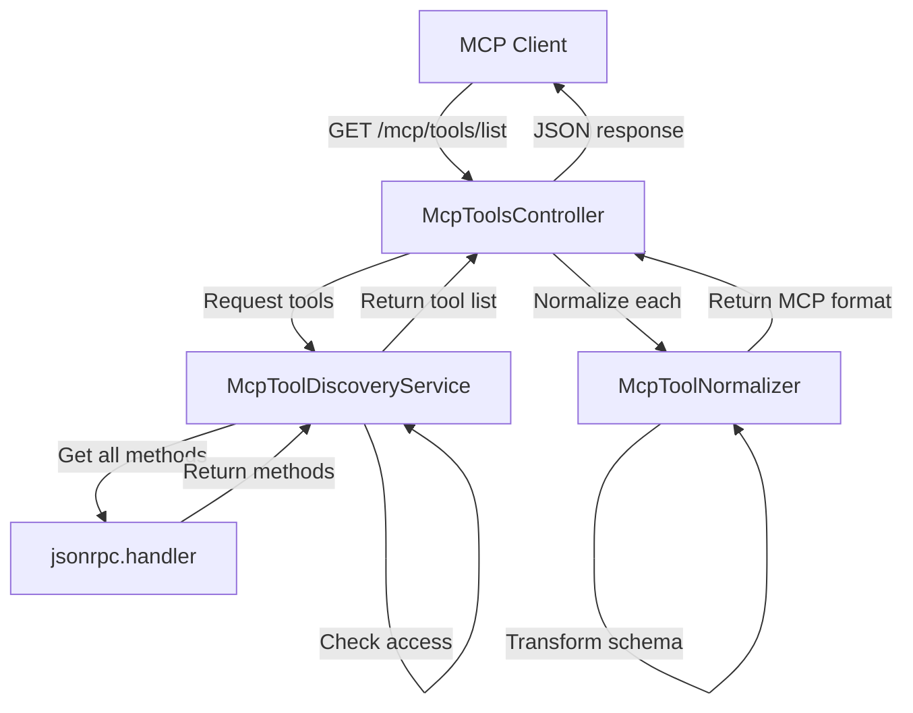
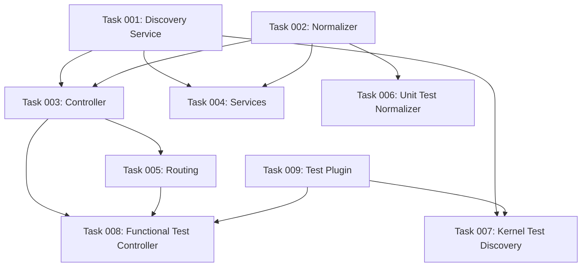

# Plan: MCP Discovery Endpoint Implementation

## Original Work Order

> Create the discovery endpoint as described in the @README.md and @AGENTS.md

## Executive Summary

This plan implements the complete MCP discovery endpoint infrastructure, including the `/mcp/tools/list` HTTP endpoint, tool discovery service, and MCP tool normalizer. The implementation follows the Model Context Protocol specification (2025-06-18) and enables MCP clients like Claude Desktop to discover and interact with Drupal's JSON-RPC methods that have been marked with the `#[McpTool]` attribute.

The endpoint will return MCP-compliant JSON responses containing tool definitions with proper schema transformation from JSON-RPC format to MCP format. The implementation includes pagination support via cursor parameters, access control integration from JSON-RPC, and comprehensive test coverage across unit, kernel, and functional test levels.

This is the second major component of the jsonrpc_mcp bridge and depends on Plan 01 (McpTool attribute) being completed first.

## Context

### Current State

After Plan 01 completion:

- `#[McpTool]` attribute exists and is tested
- Module can mark JSON-RPC methods for MCP exposure
- No discovery mechanism exists yet
- No endpoint for MCP clients to query

The jsonrpc module provides:

- `jsonrpc.handler` service for accessing JSON-RPC methods
- Plugin discovery system for `#[JsonRpcMethod]` attributes
- Access control via permissions array
- Existing `/jsonrpc/methods` discovery endpoint (JSON API format)

### Target State

After implementation:

- MCP clients can query `/mcp/tools/list` and receive MCP-compliant tool definitions
- Tool discovery service scans for methods with both `#[JsonRpcMethod]` and `#[McpTool]` attributes
- Normalizer transforms JSON-RPC metadata to MCP tool schema format
- Parameters converted from JsonRpcParameterDefinition to JSON Schema `inputSchema`
- Output schemas properly formatted as `outputSchema`
- Pagination support for large tool lists
- Access control enforced (only accessible methods returned)
- Comprehensive test coverage validates all components

### Background

**MCP Specification Requirements (2025-06-18):**

- Endpoint: `tools/list` (we'll use `/mcp/tools/list` as Drupal route)
- Request: Optional `cursor` query parameter for pagination
- Response format:
  ```json
  {
    "tools": [
      {
        "name": "string (required)",
        "description": "string (required)",
        "inputSchema": {...} (required, JSON Schema),
        "title": "string (optional)",
        "outputSchema": {...} (optional, JSON Schema),
        "annotations": {...} (optional)
      }
    ],
    "nextCursor": "string|null"
  }
  ```

**Design Decisions:**

1. Use Drupal's routing system for `/mcp/tools/list` endpoint
2. Leverage jsonrpc module's handler service to get method list
3. Create dedicated service for tool discovery logic
4. Separate normalizer for transformation logic (single responsibility)
5. No caching at this stage (can be added later if needed)

## Technical Implementation Approach

### Architecture Overview



### Component 1: MCP Tool Discovery Service

**Objective**: Centralize logic for discovering JSON-RPC methods marked with `#[McpTool]` attribute

**File Location**: `src/Service/McpToolDiscoveryService.php`

**Service Definition**: `jsonrpc_mcp.services.yml`

```yaml
services:
  jsonrpc_mcp.tool_discovery:
    class: Drupal\jsonrpc_mcp\Service\McpToolDiscoveryService
    arguments: ['@jsonrpc.handler', '@current_user']
```

**Key Responsibilities:**

1. Query jsonrpc.handler for all available JSON-RPC methods
2. Filter methods to only those with `#[McpTool]` attribute
3. Apply access control (check user permissions from `#[JsonRpcMethod]` access array)
4. Return array of method definitions with both attributes

**Implementation Approach:**

```php
namespace Drupal\jsonrpc_mcp\Service;

use Drupal\Core\Session\AccountProxyInterface;
use Drupal\jsonrpc\HandlerInterface;
use Drupal\jsonrpc\MethodInterface;

class McpToolDiscoveryService {

  public function __construct(
    protected HandlerInterface $handler,
    protected AccountProxyInterface $currentUser,
  ) {}

  /**
   * Discovers all accessible JSON-RPC methods marked as MCP tools.
   *
   * @return \Drupal\jsonrpc\MethodInterface[]
   *   Array of method interfaces with McpTool attribute.
   */
  public function discoverTools(): array {
    $all_methods = $this->handler->supportedMethods();
    $mcp_tools = [];

    foreach ($all_methods as $method_id => $method) {
      // Check if method has McpTool attribute
      if (!$this->hasM cpToolAttribute($method)) {
        continue;
      }

      // Check access permissions
      if (!$method->access('execute', $this->currentUser, FALSE)) {
        continue;
      }

      $mcp_tools[$method_id] = $method;
    }

    return $mcp_tools;
  }

  /**
   * Checks if a method has the McpTool attribute.
   */
  protected function hasMcpToolAttribute(MethodInterface $method): bool {
    // Use reflection to check for McpTool attribute on the plugin class
    $reflection = new \ReflectionClass($method->getPluginDefinition()['class']);
    $attributes = $reflection->getAttributes(McpTool::class);
    return !empty($attributes);
  }
}
```

**Testing Requirements:**

- Unit tests for attribute detection logic
- Kernel tests with actual plugin classes
- Access control validation tests

### Component 2: MCP Tool Normalizer

**Objective**: Transform JSON-RPC method definitions into MCP-compliant tool schema

**File Location**: `src/Normalizer/McpToolNormalizer.php`

**Key Responsibilities:**

1. Extract data from `#[JsonRpcMethod]` and `#[McpTool]` attributes
2. Convert `id` → `name`
3. Convert `usage` (TranslatableMarkup) → `description` (string)
4. Transform `params` array → `inputSchema` (JSON Schema object)
5. Transform `output` → `outputSchema` (JSON Schema)
6. Add `title` and `annotations` from McpTool attribute

**Schema Transformation Logic:**

```php
/**
 * Converts JsonRpcParameterDefinition array to MCP inputSchema.
 *
 * Input (JSON-RPC params):
 * [
 *   'title' => JsonRpcParameterDefinition(
 *     id: 'title',
 *     schema: ['type' => 'string'],
 *     required: true,
 *     description: TranslatableMarkup('The title')
 *   ),
 *   'count' => JsonRpcParameterDefinition(...)
 * ]
 *
 * Output (MCP inputSchema):
 * {
 *   "type": "object",
 *   "properties": {
 *     "title": {
 *       "type": "string",
 *       "description": "The title"
 *     },
 *     "count": {...}
 *   },
 *   "required": ["title"]
 * }
 */
protected function buildInputSchema(array $params): array {
  $properties = [];
  $required = [];

  foreach ($params as $param_name => $param_def) {
    $properties[$param_name] = $param_def->getSchema();

    if ($param_def->getDescription()) {
      $properties[$param_name]['description'] = (string) $param_def->getDescription();
    }

    if ($param_def->isRequired()) {
      $required[] = $param_name;
    }
  }

  $schema = [
    'type' => 'object',
    'properties' => $properties,
  ];

  if (!empty($required)) {
    $schema['required'] = $required;
  }

  return $schema;
}
```

**Testing Requirements:**

- Unit tests for each transformation rule
- Test with empty parameters
- Test with complex nested schemas
- Test TranslatableMarkup conversion

### Component 3: Discovery Controller

**Objective**: Provide HTTP endpoint `/mcp/tools/list` that returns MCP-compliant JSON

**File Location**: `src/Controller/McpToolsController.php`

**Routing**: `jsonrpc_mcp.routing.yml`

```yaml
jsonrpc_mcp.tools_list:
  path: '/mcp/tools/list'
  defaults:
    _controller: '\Drupal\jsonrpc_mcp\Controller\McpToolsController::list'
    _title: 'MCP Tools Discovery'
  requirements:
    _access: 'TRUE'
  options:
    no_cache: 'TRUE'
```

**Implementation Approach:**

```php
namespace Drupal\jsonrpc_mcp\Controller;

use Drupal\Core\Controller\ControllerBase;
use Drupal\jsonrpc_mcp\Normalizer\McpToolNormalizer;
use Drupal\jsonrpc_mcp\Service\McpToolDiscoveryService;
use Symfony\Component\HttpFoundation\JsonResponse;
use Symfony\Component\HttpFoundation\Request;
use Symfony\Component\DependencyInjection\ContainerInterface;

class McpToolsController extends ControllerBase {

  public function __construct(
    protected McpToolDiscoveryService $toolDiscovery,
    protected McpToolNormalizer $normalizer,
  ) {}

  public static function create(ContainerInterface $container): static {
    return new static(
      $container->get('jsonrpc_mcp.tool_discovery'),
      $container->get('jsonrpc_mcp.tool_normalizer'),
    );
  }

  /**
   * Returns MCP-compliant tool list.
   */
  public function list(Request $request): JsonResponse {
    $cursor = $request->query->get('cursor');
    $tools = $this->toolDiscovery->discoverTools();

    // Apply pagination (simple offset-based for now)
    $page_size = 50;
    $offset = $cursor ? (int) base64_decode($cursor) : 0;
    $page_tools = array_slice($tools, $offset, $page_size, true);

    // Normalize to MCP format
    $normalized_tools = [];
    foreach ($page_tools as $method) {
      $normalized_tools[] = $this->normalizer->normalize($method);
    }

    // Calculate next cursor
    $next_cursor = null;
    if (count($tools) > $offset + $page_size) {
      $next_cursor = base64_encode((string) ($offset + $page_size));
    }

    return new JsonResponse([
      'tools' => $normalized_tools,
      'nextCursor' => $next_cursor,
    ]);
  }
}
```

**Testing Requirements:**

- Functional tests for HTTP endpoint
- Test pagination logic
- Test empty result set
- Test access control (anonymous vs authenticated)

### Component 4: Service Definitions

**File**: `jsonrpc_mcp.services.yml`

```yaml
services:
  jsonrpc_mcp.tool_discovery:
    class: Drupal\jsonrpc_mcp\Service\McpToolDiscoveryService
    arguments: ['@jsonrpc.handler', '@current_user']

  jsonrpc_mcp.tool_normalizer:
    class: Drupal\jsonrpc_mcp\Normalizer\McpToolNormalizer
```

### Component 5: Test Infrastructure

**Test Strategy:**

1. **Unit Tests** (`tests/src/Unit/`)
   - `Normalizer/McpToolNormalizerTest.php`: Schema transformation logic
   - Mock MethodInterface and attribute data
   - Test all mapping rules independently

2. **Kernel Tests** (`tests/src/Kernel/`)
   - `Service/McpToolDiscoveryServiceTest.php`: Discovery with real plugins
   - Create test JSON-RPC method plugins in test module
   - Test access control integration
   - Test attribute detection

3. **Functional Tests** (`tests/src/Functional/`)
   - `Controller/McpToolsControllerTest.php`: HTTP endpoint behavior
   - Test full request/response cycle
   - Test pagination
   - Test JSON format compliance
   - Test with multiple test methods

**Example Test Plugin** (in `tests/modules/jsonrpc_mcp_test`):

```php
namespace Drupal\jsonrpc_mcp_test\Plugin\jsonrpc\Method;

use Drupal\Core\StringTranslation\TranslatableMarkup;
use Drupal\jsonrpc\Attribute\JsonRpcMethod;
use Drupal\jsonrpc\Attribute\JsonRpcParameterDefinition;
use Drupal\jsonrpc_mcp\Attribute\McpTool;
use Drupal\jsonrpc\Plugin\JsonRpcMethodBase;
use Drupal\jsonrpc\JsonRpcObject\ParameterBag;

#[JsonRpcMethod(
  id: "test.example",
  usage: new TranslatableMarkup("Test method for MCP"),
  access: ["access content"],
  params: [
    'input' => new JsonRpcParameterDefinition(
      'input',
      ["type" => "string"],
      null,
      new TranslatableMarkup("Test input"),
      true
    ),
  ]
)]
#[McpTool(
  title: "Test MCP Tool",
  annotations: ['category' => 'testing']
)]
class TestMethod extends JsonRpcMethodBase {
  public function execute(ParameterBag $params): array {
    return ['result' => $params->get('input')];
  }

  public static function outputSchema(): array {
    return [
      'type' => 'object',
      'properties' => ['result' => ['type' => 'string']],
    ];
  }
}
```

## Risk Considerations and Mitigation Strategies

### Technical Risks

- **Reflection Performance**: Using reflection to check for attributes on every request may be slow
  - **Mitigation**: Discovery service should cache results; consider Drupal's cache API in future iteration

- **Schema Complexity**: JSON-RPC parameter schemas may not map perfectly to JSON Schema
  - **Mitigation**: Follow jsonrpc module's own schema patterns; comprehensive unit tests for edge cases

- **Pagination Implementation**: Simple offset-based pagination may have issues with concurrent modifications
  - **Mitigation**: Acceptable for initial implementation; document limitation; can enhance with stable cursors later

### Implementation Risks

- **Dependency on jsonrpc.handler**: Internal API may change in future jsonrpc module versions
  - **Mitigation**: Use public interfaces only; add integration tests to catch breaking changes

- **Access Control Edge Cases**: Complex permission combinations may not behave as expected
  - **Mitigation**: Leverage existing jsonrpc module's access control; test with various permission scenarios

### Quality Risks

- **MCP Specification Compliance**: Subtle deviations from spec may break MCP clients
  - **Mitigation**: Test with actual MCP Inspector tool; validate JSON schema format

- **TranslatableMarkup Handling**: Converting to string may lose translation context
  - **Mitigation**: Document this limitation; render in current user's language

## Success Criteria

### Primary Success Criteria

1. `/mcp/tools/list` endpoint returns valid JSON response matching MCP specification
2. Tool discovery service correctly identifies methods with both `#[JsonRpcMethod]` and `#[McpTool]`
3. Normalizer produces valid JSON Schema for `inputSchema` and `outputSchema`
4. Access control properly filters out methods user cannot access
5. Pagination works with cursor parameter
6. All tests pass (unit, kernel, functional)

### Quality Assurance Metrics

1. **Endpoint Testing**: `curl https://drupal-site/mcp/tools/list | jq` returns valid MCP format
2. **Test Coverage**: All components have 100% code coverage
3. **MCP Inspector Validation**: `npx @modelcontextprotocol/inspector https://drupal-site/mcp/tools/list` succeeds
4. **Code Quality**: PHPStan level 5 passes, coding standards compliant
5. **Integration Test**: Test JSON-RPC method marked with `#[McpTool]` appears in discovery

## Resource Requirements

### Development Skills

- Drupal routing and controller architecture
- Symfony HttpFoundation (Request/Response)
- PHP Reflection API for attribute inspection
- JSON Schema specification knowledge
- Understanding of MCP tools/list specification (2025-06-18)
- PHPUnit testing (unit, kernel, functional)

### Technical Infrastructure

- Drupal 10.2+ or 11.x
- jsonrpc module (^3.0.0-beta1) installed and enabled
- Plan 01 (#[McpTool] attribute) completed
- MCP Inspector tool for validation (optional but recommended)
- jq for JSON testing and validation

## Integration Strategy

### Integration with Existing jsonrpc Module

- Use `jsonrpc.handler` service via dependency injection
- Respect existing access control mechanisms
- No modifications to jsonrpc module required
- Follow jsonrpc module's pattern for discovery (similar to `jsonrpc_discovery` submodule)

### Integration with Plan 01

- Depends on `#[McpTool]` attribute being implemented
- Uses reflection to detect attribute presence
- Reads attribute properties (`title`, `annotations`)

## Task Dependency Visualization



## Execution Blueprint

**Validation Gates:**

- Reference: `.ai/task-manager/config/hooks/POST_PHASE.md`

### ✅ Phase 1: Core Components

**Parallel Tasks:**

- ✔️ Task 001: Implement McpToolDiscoveryService
- ✔️ Task 002: Implement McpToolNormalizer
- ✔️ Task 009: Create Test Plugin in jsonrpc_mcp_test Module

### ✅ Phase 2: Integration

**Parallel Tasks:**

- ✔️ Task 003: Create McpToolsController (depends on: 001, 002)
- ✔️ Task 004: Define Services in jsonrpc_mcp.services.yml (depends on: 001, 002)
- ✔️ Task 006: Create Unit Tests for McpToolNormalizer (depends on: 002)
- ✔️ Task 007: Create Kernel Tests for McpToolDiscoveryService (depends on: 001, 009)

### Phase 3: Routing and HTTP Testing

**Parallel Tasks:**

- Task 005: Create Routing Configuration (depends on: 003)
- Task 008: Create Functional Tests for McpToolsController (depends on: 003, 005, 009)

### Execution Summary

- Total Phases: 3
- Total Tasks: 9
- Maximum Parallelism: 4 tasks (in Phase 2)
- Critical Path Length: 3 phases
- Complexity Notes: Task 002 (Normalizer) has highest complexity at 5.5, all others ≤4.4

## Notes

### Future Enhancements (Out of Scope)

- Caching layer for tool discovery results
- More sophisticated cursor-based pagination
- Rate limiting for public endpoints
- WebSocket support for real-time updates
- `/.well-known/mcp.json` endpoint (separate plan)

### MCP Specification Alignment

This implementation targets MCP specification version 2025-06-18. The endpoint structure follows the `tools/list` pattern defined in the specification. Future spec updates may require adjustments to response format.

### Testing with Real MCP Clients

After implementation, validate with:

```bash
# Test basic discovery
curl https://drupal-site/mcp/tools/list | jq '.tools[0]'

# Test pagination
curl 'https://drupal-site/mcp/tools/list?cursor=NTA' | jq '.nextCursor'

# Test with MCP Inspector
npx @modelcontextprotocol/inspector https://drupal-site/mcp/tools/list
```
