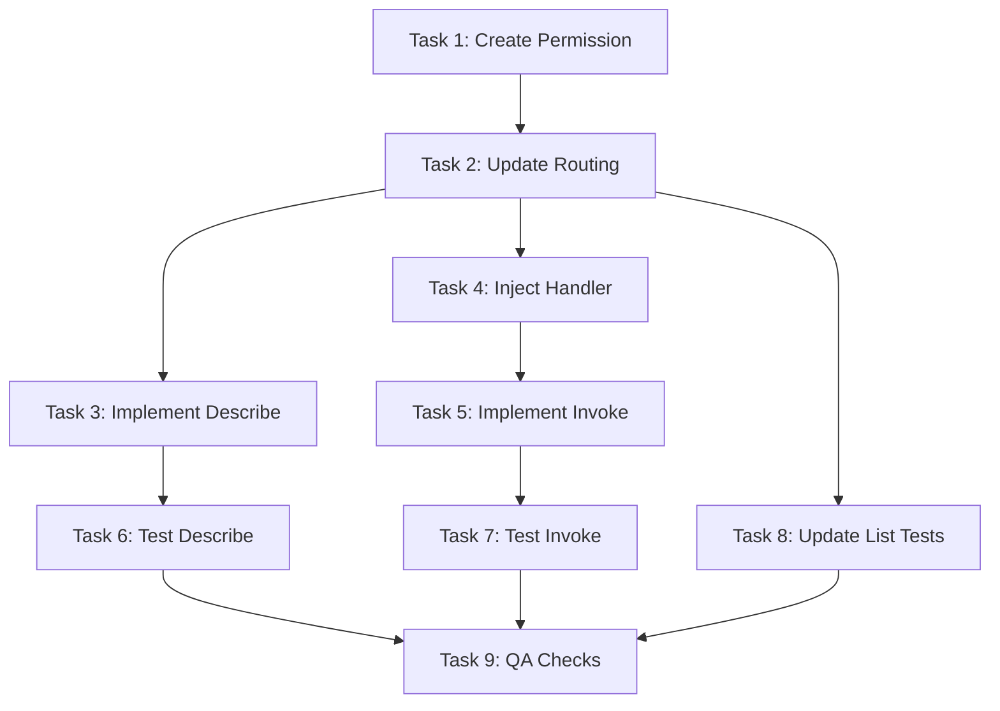

# Plan: MCP Tools Describe and Invoke Endpoints Implementation

## Original Work Order

> Ensure that the MCP discovery covers the /mcp/tools/describe routes and in general complies with the API described in this post https://www.devturtleblog.com/agentic-a2a-framework-mcp/
>
> Also introduce a new permission to access the list and description of the mcp tools. Execution of the tool will depend on the JSON-RPC access in the plugin definition and the permission to access /jsonrpc.

## Executive Summary

This plan addresses the missing `/mcp/tools/describe` and `/mcp/tools/invoke` endpoints in the jsonrpc_mcp module, which are required for full compliance with the MCP (Model Context Protocol) A2A framework. Currently, the module implements only `/mcp/tools/list` for tool discovery. The DevTurtle blog post specifies that MCP requires three core endpoints: list, describe, and invoke. The describe endpoint provides detailed schema information for specific tools, while invoke provides a unified MCP-compliant interface for executing tools.

The implementation will add two new controller methods and routes: one to handle describe requests with detailed tool schemas, and another to handle invoke requests as a passthrough to the underlying JSON-RPC handler. The invoke endpoint will translate MCP-format requests to JSON-RPC format, forward them to the existing handler, and return responses in MCP format.

Additionally, a new permission "access mcp tool discovery" will be introduced to control access to the list and describe endpoints, separating discovery capabilities from execution permissions. Tool execution via the invoke endpoint will remain controlled by the JSON-RPC module's own access control system (the `access` parameter in the `#[JsonRpcMethod]` attribute and the general `/jsonrpc` endpoint permission).

This minimal change maintains the existing architecture while completing the required API surface, providing a consistent `/mcp/tools/*` path structure, and implementing proper access control separation between discovery and execution.

## Context

### Current State

The jsonrpc_mcp module currently implements:

- **`/mcp/tools/list` endpoint** (`McpToolsController::list()`) - Returns paginated list of all available MCP tools
- **McpToolNormalizer** - Converts JSON-RPC methods to MCP tool schema format
- **McpToolDiscoveryService** - Discovers JSON-RPC methods with `#[McpTool]` attribute
- **McpTool attribute** - Marks methods for MCP exposure

The routing configuration (`jsonrpc_mcp.routing.yml`) defines only one route. The module documentation (AGENTS.md) mentions the describe endpoint as missing from the implementation roadmap.

### Target State

The module will provide a complete MCP-compliant API with all three required endpoints and proper access control:

- **`/mcp/tools/list` endpoint** - Returns paginated list of available tools (requires "access mcp tool discovery" permission)
- **`/mcp/tools/describe` endpoint** - Returns detailed schema for a specific tool identified by name parameter (requires "access mcp tool discovery" permission)
- **`/mcp/tools/invoke` endpoint** - Executes a tool with MCP-format request/response (controlled by JSON-RPC permissions)
- **New permission: "access mcp tool discovery"** - Controls who can discover available tools and their schemas
- Proper error handling for non-existent tools, access denied, and execution failures
- Consistent JSON response format across all endpoints
- Full alignment with DevTurtle MCP specification for the complete A2A framework
- Separation of concerns: discovery permissions separate from execution permissions

### Background

The MCP specification defines a stateless, JSON-based protocol for AI agent tool discovery and invocation. The DevTurtle blog post clarifies the three-endpoint pattern:

1. **list** - Discover available tools
2. **describe** - Get detailed information about specific tools
3. **invoke** - Execute a tool

While the jsonrpc module provides tool execution via its `/jsonrpc` endpoint, the MCP specification expects a unified API under the `/mcp/tools/` path prefix. Therefore, this plan implements both missing endpoints: describe for detailed schemas and invoke as a passthrough that translates between MCP and JSON-RPC formats. The describe endpoint serves as a detailed view that can include additional metadata, parameter constraints, and examples that might be too verbose for the list endpoint. The invoke endpoint provides API consistency while leveraging the existing JSON-RPC infrastructure.

The access control model separates discovery from execution: users need the "access mcp tool discovery" permission to see what tools are available and their schemas, but tool execution requires the permissions defined in each JSON-RPC method's `access` parameter plus the general `/jsonrpc` endpoint permission. This allows administrators to grant tool discovery broadly while restricting execution to specific roles.

## Technical Implementation Approach

### Permission Definition

**Objective**: Define a new permission for MCP tool discovery access control

Create `jsonrpc_mcp.permissions.yml` with a new permission:

```yaml
access mcp tool discovery:
  title: 'Access MCP tool discovery'
  description: 'Allows users to view available MCP tools and their schemas via /mcp/tools/list and /mcp/tools/describe endpoints.'
```

This permission will be checked by the routing system for the list and describe endpoints. The permission should be granted to roles that need to discover available tools (e.g., authenticated users, API consumers, AI agents). Tool execution permissions remain separate, controlled by the JSON-RPC module's access system.

### Describe Controller Method

**Objective**: Add HTTP endpoint handler for tool description requests

The `McpToolsController` class will gain a new `describe()` method that:

- Accepts a required `name` query parameter (the tool identifier)
- Uses `McpToolDiscoveryService` to retrieve all discovered tools
- Locates the specific tool by matching the `name` parameter against tool IDs
- Returns 404 response if tool not found or user lacks access
- Returns the normalized tool schema wrapped in a consistent response structure

The method signature will follow the existing `list()` pattern:

```php
public function describe(Request $request): JsonResponse
```

Response format for successful requests:

```json
{
  "tool": {
    "name": "example.method",
    "description": "Method description",
    "inputSchema": {...},
    "outputSchema": {...}
  }
}
```

Error response for missing tools (404 status):

```json
{
  "error": {
    "code": "tool_not_found",
    "message": "Tool 'invalid.name' not found or access denied"
  }
}
```

### Invoke Controller Method

**Objective**: Add HTTP endpoint for MCP-compliant tool execution

The `McpToolsController` class will gain an `invoke()` method that acts as a translation layer between MCP and JSON-RPC formats:

- Accepts POST requests with JSON body containing `name` (tool identifier) and `arguments` (parameter object)
- Validates that the requested tool exists and is accessible to the current user
- Constructs a JSON-RPC request object with method and params
- Forwards the request to the JSON-RPC handler via `HandlerInterface::execute()`
- Returns the JSON-RPC response wrapped in MCP format

The method signature:

```php
public function invoke(Request $request): JsonResponse
```

Request format (POST with JSON body):

```json
{
  "name": "example.method",
  "arguments": {
    "param1": "value1",
    "param2": "value2"
  }
}
```

Response format for successful invocation:

```json
{
  "result": {
    "field1": "value1",
    "field2": "value2"
  }
}
```

Error response for invocation failures (appropriate HTTP status):

```json
{
  "error": {
    "code": "execution_error",
    "message": "Tool execution failed: specific error message"
  }
}
```

The invoke endpoint will:

- Return 404 if tool not found or user lacks access
- Return 400 for malformed requests (missing name or invalid arguments)
- Return 500 for JSON-RPC execution errors
- Return 200 with result object for successful executions

### Routing Configuration

**Objective**: Register the describe and invoke endpoints with proper path and access controls

Update `jsonrpc_mcp.routing.yml` to add two new routes and update the existing list route:

**Updated list route:**

- Path: `/mcp/tools/list`
- Controller: `\Drupal\jsonrpc_mcp\Controller\McpToolsController::list`
- Methods: GET
- Access: `_permission: 'access mcp tool discovery'` (changed from `_access: 'TRUE'`)
- Options: No cache (`no_cache: 'TRUE'`) for dynamic content

**New describe route:**

- Path: `/mcp/tools/describe`
- Controller: `\Drupal\jsonrpc_mcp\Controller\McpToolsController::describe`
- Methods: GET
- Access: `_permission: 'access mcp tool discovery'`
- Options: No cache (`no_cache: 'TRUE'`) for dynamic content

**New invoke route:**

- Path: `/mcp/tools/invoke`
- Controller: `\Drupal\jsonrpc_mcp\Controller\McpToolsController::invoke`
- Methods: POST
- Access: `_access: 'TRUE'` - access control delegated to JSON-RPC handler
- Options: No cache (`no_cache: 'TRUE'`) for dynamic execution

This access control model allows administrators to control tool discovery separately from execution. The invoke endpoint remains publicly accessible at the routing level because access control is enforced by the JSON-RPC handler based on each method's `access` attribute and the `/jsonrpc` endpoint permissions.

### Normalizer Enhancement (If Needed)

**Objective**: Ensure normalizer supports describe endpoint requirements

Evaluate whether the existing `McpToolNormalizer::normalize()` method provides sufficient detail for describe responses. The current implementation already includes:

- Tool name, description, title
- Complete inputSchema with properties and required fields
- outputSchema (if defined)
- Annotations metadata

If the describe endpoint requires additional information not currently in the normalized output (e.g., examples, parameter constraints, deprecation warnings), extend the normalizer method or add a new `normalizeDetailed()` method. The McpTool attribute may also need new optional properties to support this metadata.

### Testing Strategy

**Objective**: Ensure describe and invoke endpoints function correctly across scenarios

Add functional test coverage in `tests/src/Functional/Controller/McpToolsControllerTest.php`:

**Describe endpoint tests:**

- Test successful describe request for existing tool (with "access mcp tool discovery" permission)
- Test 403 response when user lacks "access mcp tool discovery" permission
- Test 404 response for non-existent tool name
- Test response format matches expected structure
- Test that outputSchema appears when defined
- Test that annotations and title appear when provided

**Invoke endpoint tests:**

- Test successful tool invocation with valid parameters (user has JSON-RPC method permissions)
- Test 403/error response when user lacks JSON-RPC method permissions
- Test 404 response for non-existent tool name
- Test 400 response for malformed request (missing name or arguments)
- Test response format matches expected structure
- Test error handling for tool execution failures
- Test parameter validation (required parameters, type validation)

**List endpoint tests (updated):**

- Test 403 response when user lacks "access mcp tool discovery" permission (regression test for permission change)

Use the existing jsonrpc_mcp_examples module's test methods (ListArticles, ArticleToMarkdown, ListContentTypes) as test subjects to validate real-world usage. The invoke tests should verify both successful executions and error conditions to ensure proper error translation from JSON-RPC to MCP format.

## Risk Considerations and Mitigation Strategies

### Technical Risks

- **Inconsistent Response Format**: The describe and list endpoints might return schemas in different formats
  - **Mitigation**: Use the same normalizer service for both endpoints, ensuring identical schema structure. Add explicit format validation in tests.

- **Performance with Large Parameter Schemas**: Some JSON-RPC methods may have complex parameter definitions that create verbose schemas
  - **Mitigation**: The describe endpoint returns single tools, so response size is bounded. No pagination needed. Consider adding response compression at the web server level if needed in production.

### Implementation Risks

- **Breaking Changes to Existing API**: Modifying the normalizer might affect list endpoint responses
  - **Mitigation**: Extend normalizer with new methods rather than modifying existing ones. Run full test suite before and after changes to catch regressions.

- **Access Control Edge Cases**: Users with "access mcp tool discovery" permission can see all tools in list/describe, but may not be able to invoke them if they lack JSON-RPC method permissions
  - **Mitigation**: This is expected and desired behavior - discovery permissions are separate from execution permissions. Document this clearly in the permission description and module documentation. The invoke endpoint should return clear error messages when users attempt to execute tools they don't have permission for.

- **JSON-RPC Handler Integration**: The invoke endpoint depends on correct integration with the JSON-RPC handler's execution mechanism
  - **Mitigation**: Study the existing `/jsonrpc` endpoint implementation to understand the proper way to construct and execute JSON-RPC requests. Use the HandlerInterface::execute() method or equivalent. Add comprehensive error handling to translate JSON-RPC errors to MCP format.

- **Request Format Translation**: MCP and JSON-RPC have different request structures that must be properly translated
  - **Mitigation**: Create explicit mapping logic between MCP `{name, arguments}` format and JSON-RPC `{method, params}` format. Add validation to ensure arguments match the tool's input schema before forwarding to JSON-RPC.

- **Permission System Changes**: Adding the new permission and updating the list endpoint route will change existing behavior
  - **Mitigation**: This is a breaking change for sites using the module. Document in release notes that administrators must grant the "access mcp tool discovery" permission to roles that need access to the list endpoint. Consider providing an update hook that grants the permission to roles that had access to the site content (or all authenticated users) to minimize disruption.

## Success Criteria

### Primary Success Criteria

1. `/mcp/tools/list` endpoint requires "access mcp tool discovery" permission and returns 403 without it
2. `/mcp/tools/describe` endpoint returns correct tool schema for valid tool names with 200 status (with permission)
3. `/mcp/tools/describe` endpoint returns 403 when user lacks "access mcp tool discovery" permission
4. `/mcp/tools/invoke` endpoint successfully executes tools and returns results in MCP format (when user has JSON-RPC permissions)
5. `/mcp/tools/invoke` endpoint returns appropriate error when user lacks JSON-RPC method permissions
6. All endpoints return appropriate error responses (403, 404, 400, 500) with structured error objects
7. Response formats match MCP specification and maintain consistency across all endpoints
8. Access control properly separates discovery permissions from execution permissions

### Quality Assurance Metrics

1. Functional test coverage includes at least 15 test cases (6 for describe, 7 for invoke, 2 for list permission changes)
2. Tests verify both positive and negative permission scenarios for all endpoints
3. PHPStan static analysis passes with no new errors
4. Drupal coding standards (PHPCS) pass for all new code
5. Manual testing with curl confirms responses match MCP specification for all three endpoints
6. Manual testing confirms permission system works correctly (403 responses when lacking permission)

## Resource Requirements

### Development Skills

- **Drupal Controller Development**: Understanding of Drupal's controller architecture, JsonResponse, and POST request handling
- **Drupal Routing**: Knowledge of routing.yml configuration, path/access requirements, and HTTP method restrictions
- **PHP Reflection API**: Familiarity with attribute inspection (already used in existing code)
- **JSON Schema**: Understanding of JSON Schema Draft 7 for validation
- **JSON-RPC Protocol**: Understanding of JSON-RPC request/response format and the jsonrpc module's HandlerInterface
- **HTTP Request Parsing**: Ability to parse and validate JSON request bodies

### Technical Infrastructure

- **Existing Services**: No new services required (reuses McpToolDiscoveryService, McpToolNormalizer, and jsonrpc's HandlerInterface)
- **Dependencies**: The invoke endpoint requires integration with the jsonrpc module's handler service
- **Testing Tools**: PHPUnit for functional tests, curl for manual endpoint testing
- **Development Environment**: Drupal 11.1 with jsonrpc module ^3.0.0-beta1

## Implementation Order

1. Create `jsonrpc_mcp.permissions.yml` with "access mcp tool discovery" permission
2. Update all three route definitions in `jsonrpc_mcp.routing.yml` (list, describe, invoke)
3. Implement `describe()` method in `McpToolsController`
4. Implement `invoke()` method in `McpToolsController` with JSON-RPC handler integration
5. Inject HandlerInterface dependency into McpToolsController constructor
6. Update existing list endpoint tests to account for new permission requirement
7. Add functional tests for describe endpoint in `McpToolsControllerTest.php` (including permission tests)
8. Add functional tests for invoke endpoint in `McpToolsControllerTest.php` (including JSON-RPC permission tests)
9. Run cache rebuild (`vendor/bin/drush cache:rebuild`)
10. Execute test suite to validate implementation
11. Perform manual testing with curl against example tools (all three endpoints, with and without permissions)
12. Run code quality checks (PHPStan, PHPCS)
13. Consider adding update hook to grant permission to existing roles (optional, for smoother upgrade path)

## Notes

- **Breaking Change**: Adding the "access mcp tool discovery" permission requirement to the list endpoint changes existing behavior. Sites upgrading to this version will need to grant the permission to appropriate roles. Consider documenting this prominently in release notes.
- The invoke endpoint acts as a translation layer, providing API consistency with `/mcp/tools/*` path prefix while delegating actual execution to the jsonrpc module's handler
- The module already includes example MCP tools in the jsonrpc_mcp_examples submodule for testing (ListArticles, ArticleToMarkdown, ListContentTypes)
- Consider adding documentation to AGENTS.md about both new endpoints and the permission system once implemented
- The describe endpoint does not require pagination since it returns a single tool
- The invoke endpoint should preserve all JSON-RPC error information while wrapping it in MCP format for client compatibility
- **Access Control Philosophy**: Discovery (list/describe) is protected by "access mcp tool discovery" permission, allowing broad visibility of available tools. Execution (invoke) is protected by JSON-RPC method-level permissions, allowing fine-grained control over who can actually use each tool. This separation enables use cases like "let users see what's available, but only execute specific tools they need."
- The permission title and description should be clear enough for site administrators to understand what granting it allows

## Task Dependencies



## Execution Blueprint

**Validation Gates:**

- Reference: `.ai/task-manager/config/hooks/POST_PHASE.md`

### Phase 1: Foundation - Permission System

**Parallel Tasks:**

- Task 1: Create MCP Tool Discovery Permission Definition

### Phase 2: Infrastructure - Routing and Dependencies

**Parallel Tasks:**

- Task 2: Update Routing Configuration for MCP Endpoints (depends on: 1)

### Phase 3: Core Implementation

**Parallel Tasks:**

- Task 3: Implement Describe Endpoint in McpToolsController (depends on: 2)
- Task 4: Inject JSON-RPC Handler Dependency into Controller (depends on: 2)

### Phase 4: Advanced Implementation

**Parallel Tasks:**

- Task 5: Implement Invoke Endpoint with JSON-RPC Integration (depends on: 4)

### Phase 5: Test Coverage

**Parallel Tasks:**

- Task 6: Add Functional Tests for Describe Endpoint (depends on: 3)
- Task 7: Add Functional Tests for Invoke Endpoint (depends on: 5)
- Task 8: Update List Endpoint Tests for Permission Change (depends on: 2)

### Phase 6: Quality Assurance

**Parallel Tasks:**

- Task 9: Run Test Suite and Code Quality Checks (depends on: 6, 7, 8)

### Execution Summary

- Total Phases: 6
- Total Tasks: 9
- Maximum Parallelism: 3 tasks (in Phase 3 and Phase 5)
- Critical Path Length: 6 phases
- Estimated Complexity: All tasks ≤5 (no high-complexity tasks)
