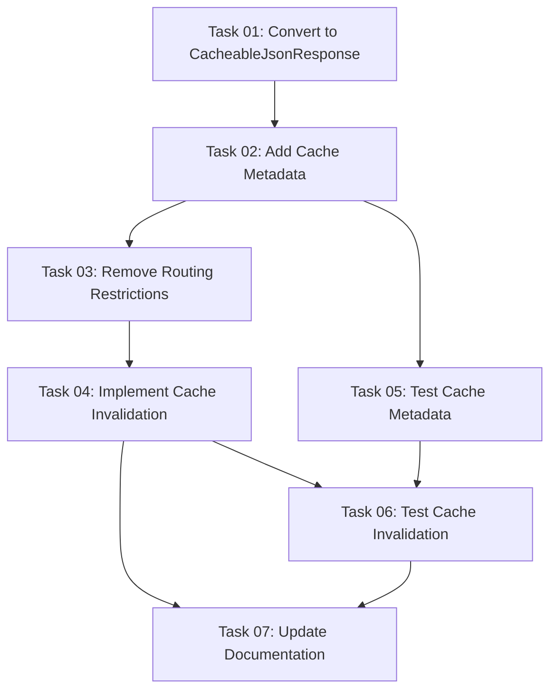

# Plan: MCP Discovery Endpoint Caching Implementation

## Original Work Order

> I want to make sure that the discovery endpoints that return JSON return a cacheable JSON response object so the responses can be cached by page cache. Ideally these responses will be cached with a permanent maxAge which is the default and they would have the appropriate cache tags for the plugins that they represent. I am not sure if there is a cache tag for that that gets invalidated. If not then only provide the cache tags that you think are the most appropriate. Investigate this for me. Create a plan to make these responses cached and their caches invalidated whenever it's time.

## Executive Summary

This plan addresses the implementation of proper caching for the JSON-RPC MCP discovery endpoints (`/mcp/tools/list` and `/mcp/tools/describe`). Currently, these endpoints return standard `JsonResponse` objects with `no_cache: 'TRUE'` routing options, preventing any caching. The implementation will convert these to `CacheableJsonResponse` objects with appropriate cache metadata, enabling page cache storage while ensuring proper invalidation when plugin definitions change.

The approach leverages Drupal's native `CacheableJsonResponse` class and cache tag system to provide efficient caching without introducing custom cache management logic. Based on Drupal core's recent shift away from cache tags for plugin managers (per change record #3355227), we'll implement a hybrid approach using general cache tags that get invalidated through standard plugin system mechanisms.

## Context

### Current State

The MCP discovery endpoints currently have several caching-related limitations:

1. **No Caching**: Routes defined in `jsonrpc_mcp.routing.yml` explicitly disable caching with `no_cache: 'TRUE'` option
2. **Standard JsonResponse**: Controller methods in `McpToolsController` return `JsonResponse` objects that don't support cacheability metadata
3. **Missing Cache Dependencies**: No cache tags, contexts, or max-age values are attached to responses
4. **Inefficient Repeated Calls**: Every request triggers full plugin discovery and normalization, even when plugin definitions haven't changed

This results in unnecessary performance overhead, especially problematic for MCP clients that may frequently poll the discovery endpoints.

### Target State

The enhanced implementation will provide:

1. **CacheableJsonResponse Objects**: All JSON responses will use `CacheableJsonResponse` for proper cache metadata support
2. **Permanent Caching by Default**: Responses cached with `Cache::PERMANENT` max-age (until explicitly invalidated)
3. **Appropriate Cache Tags**: Responses tagged with relevant invalidation triggers (per-user permissions, plugin system changes)
4. **Automatic Invalidation**: Cache clearing integrated with Drupal's plugin system lifecycle (module install/uninstall, cache rebuilds)
5. **Maintained Performance**: Page cache can serve cached responses without PHP execution

### Background

**Drupal Plugin System Cache Evolution**: Drupal core recently moved away from using cache tags for plugin managers with finite variations (see change record #3355227). Plugin managers like `ElementInfoManager`, `LocalActionManager`, and others no longer use cache tags. The recommended approach is to call `CachedDiscoveryInterface::clearCachedDefinitions()` for plugin definition invalidation.

**JSON-RPC Plugin Discovery**: The `jsonrpc` module uses the `jsonrpc.handler` service which internally manages plugin discovery. The MCP module's `McpToolDiscoveryService` filters these plugins based on the `#[McpTool]` attribute.

**Cache Invalidation Trigger Points**:

- Module/theme enable/disable (triggers `plugin.cache_clearer` service)
- Manual cache rebuild (`drush cache:rebuild`)
- Plugin-specific `clearCachedDefinitions()` calls
- Configuration changes affecting permissions

## Technical Implementation Approach

### Component 1: Response Object Migration

**Objective**: Replace standard `JsonResponse` with `CacheableJsonResponse` in all discovery endpoints to enable cache metadata attachment.

The `McpToolsController` will be updated to:

- Import `Drupal\Core\Cache\CacheableJsonResponse` instead of `Symfony\Component\HttpFoundation\JsonResponse`
- Return `CacheableJsonResponse` instances from `list()`, `describe()`, and `invoke()` methods
- Maintain backward compatibility with existing response structure (no JSON format changes)

Error responses (400, 404, 500 status codes) will also use `CacheableJsonResponse` but with appropriate cache metadata (e.g., short max-age or no caching for errors).

### Component 2: Cache Metadata Configuration

**Objective**: Attach appropriate cacheability metadata to enable effective caching while ensuring correct invalidation.

**Cache Tags Strategy**:
Since Drupal core no longer provides plugin-specific cache tags for JSON-RPC plugins, we'll use a combination of:

1. **Permission-based tags**: `user.permissions` - Invalidated when permission system changes
2. **Custom module tag**: `jsonrpc_mcp:discovery` - Explicitly invalidated during module lifecycle events
3. **User context**: Add `user` cache context to vary cached responses per user (since access control filters tools based on permissions)

**Max-Age Configuration**:

- Discovery endpoints (`/mcp/tools/list`, `/mcp/tools/describe`): `Cache::PERMANENT`
- Invocation endpoint (`/mcp/tools/invoke`): `0` (never cache, as it executes actions)

**Cache Contexts**:

- `user`: Responses vary by user due to permission-based tool filtering
- `url.query_args` (for `/mcp/tools/list`): Handle pagination cursor parameter variations

### Component 3: Cache Invalidation Integration

**Objective**: Ensure cached discovery responses are invalidated when plugin definitions change or when access control conditions are modified.

**Implementation Points**:

1. **Hook into Module Lifecycle**: Implement `hook_module_implements_alter()` or subscribe to module install/uninstall events to invalidate the `jsonrpc_mcp:discovery` cache tag

2. **Cache Rebuild Integration**: The custom cache tag will be automatically invalidated during `drush cache:rebuild` operations through Drupal's standard cache clearing

3. **Permission System Changes**: Leverage existing `user.permissions` cache tag invalidation (Drupal core handles this automatically)

4. **Manual Invalidation Method**: Provide a service method `McpToolDiscoveryService::invalidateDiscoveryCache()` for programmatic cache clearing when needed

### Component 4: Routing Configuration Update

**Objective**: Remove the `no_cache: 'TRUE'` routing options that currently prevent all caching.

Update `jsonrpc_mcp.routing.yml` to remove the `options: no_cache: 'TRUE'` lines from:

- `jsonrpc_mcp.tools_list`
- `jsonrpc_mcp.tools_describe`

Keep `no_cache: 'TRUE'` for `jsonrpc_mcp.tools_invoke` since this endpoint executes actions and should never be cached.

### Component 5: Cache Metadata Application

**Objective**: Systematically apply cache metadata to all response objects using Drupal's cacheability API.

**Implementation Pattern**:

```php
use Drupal\Core\Cache\CacheableJsonResponse;
use Drupal\Core\Cache\CacheableMetadata;

public function list(Request $request): CacheableJsonResponse {
  // ... existing discovery logic ...

  $response = new CacheableJsonResponse([
    'tools' => $normalized_tools,
    'nextCursor' => $next_cursor,
  ]);

  $cache_metadata = new CacheableMetadata();
  $cache_metadata->setCacheMaxAge(Cache::PERMANENT);
  $cache_metadata->setCacheTags(['jsonrpc_mcp:discovery', 'user.permissions']);
  $cache_metadata->setCacheContexts(['user', 'url.query_args:cursor']);

  $response->addCacheableDependency($cache_metadata);

  return $response;
}
```

This pattern will be applied consistently across `list()` and `describe()` methods, with appropriate variations for their specific cache contexts.

## Risk Considerations and Mitigation Strategies

### Technical Risks

- **Stale Cache After Plugin Changes**: Cached responses might serve outdated tool lists if invalidation doesn't trigger properly
  - **Mitigation**: Implement multiple invalidation triggers (custom tag, permission tag, module lifecycle hooks) to ensure coverage; add comprehensive testing for cache invalidation scenarios

- **Permission Changes Not Reflected**: User gains/loses permission but continues seeing cached response
  - **Mitigation**: Use `user` cache context to vary responses per user; rely on `user.permissions` cache tag for global permission changes

- **Pagination Cursor Issues**: Different cursor values might serve incorrect cached responses
  - **Mitigation**: Include `url.query_args:cursor` cache context to create separate cache entries per cursor value

### Implementation Risks

- **Backward Compatibility**: Changing response objects might affect existing consumers
  - **Mitigation**: `CacheableJsonResponse` extends `JsonResponse`, maintaining full API compatibility; JSON output structure remains unchanged

- **Cache Tag Naming Conflicts**: Custom tag `jsonrpc_mcp:discovery` might conflict with other modules
  - **Mitigation**: Use module-prefixed tag name following Drupal conventions; document the tag in module documentation

### Quality Risks

- **Insufficient Test Coverage**: Cache behavior might not be properly validated
  - **Mitigation**: Add kernel tests for cache tag attachment, functional tests for cache invalidation, and integration tests for end-to-end caching behavior

- **Performance Regression**: Adding cache metadata might introduce overhead
  - **Mitigation**: Cache metadata operations are lightweight; overall performance will improve due to reduced plugin discovery on cached responses

## Success Criteria

### Primary Success Criteria

1. **Cacheable Responses**: All discovery endpoints return `CacheableJsonResponse` objects with proper cache metadata
2. **Effective Caching**: Page cache successfully stores and serves discovery responses without PHP execution
3. **Automatic Invalidation**: Cache invalidates correctly when modules are installed/uninstalled or cache is rebuilt
4. **Permission-Aware Caching**: Responses vary correctly based on user permissions and access control

### Quality Assurance Metrics

1. **Test Coverage**: Kernel tests verify cache metadata attachment; functional tests validate invalidation triggers
2. **Performance Validation**: Subsequent requests to discovery endpoints are served from cache (measurable via webprofiler or XDebug)
3. **Code Standards Compliance**: All changes pass phpcs/phpstan checks with no new violations
4. **Documentation**: Cache tag usage and invalidation strategy documented in code comments and module documentation

## Resource Requirements

### Development Skills

- **Drupal Cache API**: Deep understanding of cache tags, contexts, max-age, and `CacheableMetadata` API
- **Plugin System Knowledge**: Familiarity with JSON-RPC plugin architecture and discovery mechanisms
- **Testing Expertise**: Ability to write kernel and functional tests for caching behavior

### Technical Infrastructure

- **Drupal Core APIs**: `CacheableJsonResponse`, `CacheableMetadata`, `Cache::PERMANENT`
- **Existing Services**: `jsonrpc.handler`, `jsonrpc_mcp.tool_discovery`
- **Testing Framework**: PHPUnit with Drupal's testing base classes (`KernelTestBase`, `BrowserTestBase`)

## Implementation Order

1. **Update Response Objects**: Convert `JsonResponse` to `CacheableJsonResponse` in `McpToolsController`
2. **Apply Cache Metadata**: Add cache tags, contexts, and max-age to discovery endpoint responses
3. **Remove Routing Restrictions**: Delete `no_cache: 'TRUE'` from routing configuration for discovery endpoints
4. **Implement Invalidation**: Add cache tag invalidation during module lifecycle events
5. **Add Tests**: Create kernel and functional tests for cache behavior validation
6. **Documentation**: Update code comments and module docs with caching strategy details

## Notes

- The `invoke` endpoint (`/mcp/tools/invoke`) should remain uncached as it executes state-changing operations
- Consider future enhancement: Add cache warming during module install to preload discovery cache
- Monitor Drupal core's plugin caching evolution; future core changes might provide better native cache tag support for plugins
- The `url.query_args:cursor` cache context ensures pagination works correctly with caching enabled

## Task Dependencies



## Execution Blueprint

**Validation Gates:**

- Reference: `.ai/task-manager/config/hooks/POST_PHASE.md`

### Phase 1: Response Object Migration ✅

**Parallel Tasks:**

- ✔️ Task 01: Convert to CacheableJsonResponse

### Phase 2: Cache Configuration ✅

**Parallel Tasks:**

- ✔️ Task 02: Add Cache Metadata (depends on: 01)

### Phase 3: Routing and Core Invalidation ✅

**Parallel Tasks:**

- ✔️ Task 03: Remove Routing Restrictions (depends on: 02)
- ✔️ Task 05: Test Cache Metadata (depends on: 02)

### Phase 4: Cache Lifecycle Integration

**Parallel Tasks:**

- Task 04: Implement Cache Invalidation (depends on: 03)

### Phase 5: Integration Testing

**Parallel Tasks:**

- Task 06: Test Cache Invalidation (depends on: 04, 05)

### Phase 6: Documentation

**Parallel Tasks:**

- Task 07: Update Documentation (depends on: 04, 06)

### Execution Summary

- Total Phases: 6
- Total Tasks: 7
- Maximum Parallelism: 2 tasks (in Phase 3)
- Critical Path Length: 6 phases
- Critical Path: 01 → 02 → 03 → 04 → 06 → 07
