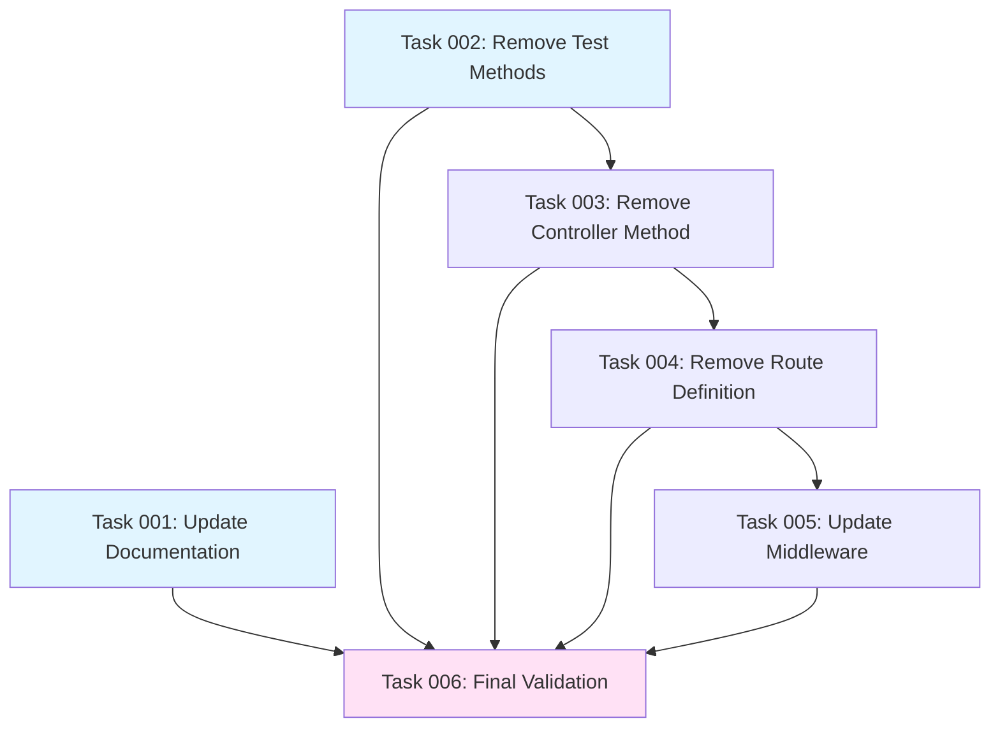

# Plan: Remove MCP Invoke Endpoint in Favor of JSON-RPC

## Original Work Order

> This module includes a route for the path `/mcp/tools/invoke`. I want to drop this route completely in favor of the `/jsonrpc` route. The task is to remove all the code and the tests for the route that we are dropping inside of this module. And update the documentation to use the jsonRPC endpoint instead.

## Executive Summary

This plan consolidates tool execution by removing the custom `/mcp/tools/invoke` endpoint and directing all MCP tool invocations to use the standard `/jsonrpc` endpoint instead. The MCP-specific invoke endpoint was originally created to provide an MCP-compliant interface, but it duplicates functionality already provided by the JSON-RPC module. By removing this endpoint, we simplify the architecture, reduce code maintenance burden, and align with the module's core purpose of exposing JSON-RPC methods as discoverable MCP tools rather than creating alternative execution paths.

The removal impacts four main areas: routing configuration, controller implementation, middleware path checking, functional tests, and documentation. All existing MCP tool functionality will remain intact—only the HTTP endpoint through which tools are invoked will change from `/mcp/tools/invoke` to `/jsonrpc`.

## Context

### Current State

The jsonrpc_mcp module currently provides three HTTP endpoints for MCP protocol support:

1. **`/mcp/tools/list`** - Discovery endpoint (returns paginated list of MCP tools)
2. **`/mcp/tools/describe`** - Detail endpoint (returns schema for specific tool)
3. **`/mcp/tools/invoke`** - Execution endpoint (translates MCP requests to JSON-RPC and executes)

The `/mcp/tools/invoke` endpoint exists in:

- **Routing**: `jsonrpc_mcp.routing.yml` lines 21-31
- **Controller**: `McpToolsController::invoke()` method (lines 166-287, 122 lines of code)
- **Middleware**: `OAuthScopeValidator.php` line 41 (path check: `if ($request->getPathInfo() !== '/mcp/tools/invoke')`)
- **Tests**: `McpToolsControllerTest.php` with 5 test methods covering success, errors, malformed requests, and permission checks (lines 318-428)
- **Documentation**: Multiple references in README.md (API reference section, curl examples, usage guidelines)

The invoke endpoint performs these operations:

1. Validates JSON request body format
2. Validates required parameters (name, arguments)
3. Checks tool existence and user access
4. Translates MCP request format to JSON-RPC request format
5. Executes via `HandlerInterface::batch()`
6. Translates JSON-RPC response back to MCP format
7. Returns MCP-compliant JSON response

### Target State

After plan completion:

- The `/mcp/tools/invoke` route will no longer exist
- The `McpToolsController::invoke()` method will be removed
- The `OAuthScopeValidator` middleware will no longer check for the `/mcp/tools/invoke` path
- All functional tests for the invoke endpoint will be removed
- Documentation will be updated to direct users to use the standard `/jsonrpc` endpoint for tool execution
- The module will maintain only two HTTP endpoints: `/mcp/tools/list` and `/mcp/tools/describe` for MCP discovery
- Tool execution will happen through the native JSON-RPC endpoint using standard JSON-RPC 2.0 request format

### Background

The `/mcp/tools/invoke` endpoint was implemented as part of plan-05 to provide full MCP A2A framework compliance based on the DevTurtle blog post specification. At the time, it was believed that having an MCP-specific invoke endpoint would simplify client integration by providing request/response translation.

However, the architectural decision to create this endpoint introduces several concerns:

- **Code duplication**: The invoke endpoint essentially wraps the JSON-RPC handler with translation logic
- **Maintenance burden**: Two execution paths means two sets of tests, two permission systems, and two sets of error handling
- **Scope creep**: The module's stated purpose is "exposing JSON-RPC methods as MCP tools" (discovery), not providing alternative execution interfaces
- **Client complexity**: MCP clients must understand both discovery endpoints AND a custom invoke endpoint, rather than using standard JSON-RPC

The decision to remove this endpoint aligns with the module's architectural principle that it should be a **discovery bridge** rather than an **execution proxy**. MCP clients can use the discovery endpoints to find tools and their schemas, then invoke them directly via the standard `/jsonrpc` endpoint using JSON-RPC 2.0 protocol.

## Technical Implementation Approach

### Component 1: Route Definition Removal

**Objective**: Remove the `/mcp/tools/invoke` route definition from routing configuration

The routing file defines three routes. We will remove the `jsonrpc_mcp.tools_invoke` route entry (lines 21-31) while preserving the `tools_list` and `tools_describe` routes.

**Implementation details:**

- File: `jsonrpc_mcp.routing.yml`
- Remove lines 21-31 (route definition for `jsonrpc_mcp.tools_invoke`)
- Preserve blank lines between remaining route definitions for readability
- No other files depend on the route name (verified via grep)

### Component 2: Controller Method Removal

**Objective**: Remove the `invoke()` method from McpToolsController while preserving list() and describe() methods

The controller file contains three public methods. We will remove the `invoke()` method (lines 166-287) while preserving the class structure and remaining methods.

**Implementation details:**

- File: `src/Controller/McpToolsController.php`
- Remove `invoke()` method (lines 166-287)
- Remove unused imports if applicable:
  - `Drupal\Component\Serialization\Json` (only used in invoke method)
  - `Drupal\jsonrpc\Exception\JsonRpcException` (only used in invoke method)
  - `Drupal\jsonrpc\JsonRpcObject\ParameterBag` (only used in invoke method)
  - `Drupal\jsonrpc\JsonRpcObject\Request as RpcRequest` (only used in invoke method)
- Update class docblock to remove references to `/mcp/tools/invoke` (line 24)
- Constructor will still inject HandlerInterface, but it will no longer be used (consider removing in future refactor if no other use is found)

### Component 3: Middleware Path Check Update

**Objective**: Update OAuthScopeValidator middleware to remove path check for deleted endpoint

The OAuthScopeValidator middleware currently only operates on `/mcp/tools/invoke` requests (line 41). Since that endpoint is being removed, the path check becomes meaningless.

**Implementation details:**

- File: `src/Middleware/OAuthScopeValidator.php`
- **Option A (Recommended)**: Remove the path check entirely and let the middleware process all requests (if OAuth scope validation should apply to all MCP endpoints)
- **Option B**: Remove the middleware entirely if it's only intended for the invoke endpoint
- **Decision needed**: Review the middleware's purpose and determine correct approach
  - If middleware is specific to invoke endpoint → Remove entire middleware class and service definition
  - If middleware should apply to other endpoints → Remove path-specific check

**Note**: This component requires clarification on the intended scope of OAuth validation. The safe default is to remove the path check and preserve the middleware for potential future use.

### Component 4: Functional Test Removal

**Objective**: Remove all functional tests for the invoke endpoint while preserving tests for list and describe endpoints

The test file contains 5 test methods specifically for the invoke endpoint (lines 318-428). These must be removed while preserving the remaining test methods.

**Implementation details:**

- File: `tests/src/Functional/Controller/McpToolsControllerTest.php`
- Remove test methods:
  - `testInvokeEndpointSuccess()` (lines 318-344)
  - `testInvokeEndpointToolNotFound()` (lines 346-373)
  - `testInvokeEndpointMalformedRequest()` (lines 375-402)
  - `testInvokeEndpointInvalidJson()` (lines 404-428)
- Preserve all other test methods (list endpoint tests, describe endpoint tests, permission tests)
- Update class docblock if it references invoke endpoint testing

### Component 5: Documentation Updates

**Objective**: Update README.md and AGENTS.md to remove references to `/mcp/tools/invoke` and add guidance on using `/jsonrpc` endpoint

Documentation files contain multiple references to the invoke endpoint that must be updated or removed.

**Implementation details:**

**README.md changes:**

- Remove `/mcp/tools/invoke` from architecture diagram (line 30)
- Update "Metadata Mapping" table to clarify execution happens via JSON-RPC (around line 54)
- Update "API Reference" section:
  - Remove "POST /mcp/tools/invoke" section (around line 372)
  - Add new section explaining how to invoke tools via `/jsonrpc` endpoint
  - Include JSON-RPC 2.0 request format example
  - Update workflow diagram (around line 170) to show `/jsonrpc` as execution endpoint
- Update curl examples (line 229) to use `/jsonrpc` endpoint with JSON-RPC 2.0 format
- Update "When to use" guidance (line 188) to reference JSON-RPC endpoint

**AGENTS.md changes:**

- Update caching documentation (line 78) to remove reference to invoke endpoint
- Update any workflow diagrams or examples that reference `/mcp/tools/invoke`

**New documentation content to add:**

- Section explaining JSON-RPC 2.0 request format for tool execution
- Example curl command for invoking tools via `/jsonrpc`
- Clarification that MCP discovery endpoints are for schema discovery only
- Link to JSON-RPC module documentation for execution details

## Risk Considerations and Mitigation Strategies

### Technical Risks

- **Breaking changes for existing MCP clients**: Any MCP clients currently using `/mcp/tools/invoke` will break
  - **Mitigation**: This is an internal module in active development (not yet released on drupal.org). Document the breaking change clearly. If there are external users, provide migration guide in documentation.

- **OAuth middleware unintended consequences**: Removing path check from middleware might cause it to run on endpoints where it shouldn't
  - **Mitigation**: Review middleware implementation carefully. Add comprehensive tests for remaining endpoints. Consider removing middleware entirely if its only purpose was invoke endpoint validation.

- **Incomplete removal leaving dead code**: Constructor still injects HandlerInterface but doesn't use it after invoke() removal
  - **Mitigation**: Document this as technical debt. Consider removal in follow-up refactor if no other methods use it.

### Implementation Risks

- **Test suite regression**: Removing invoke tests might inadvertently break other tests due to shared setup code
  - **Mitigation**: Run full test suite after each removal. Verify describe and list endpoint tests still pass.

- **Documentation gaps**: Simply removing invoke documentation without adding JSON-RPC guidance leaves users confused
  - **Mitigation**: Add comprehensive JSON-RPC usage section before removing invoke documentation. Include practical examples and links to JSON-RPC module docs.

### Integration Risks

- **JSON-RPC module version compatibility**: Relying solely on `/jsonrpc` endpoint assumes JSON-RPC module provides necessary functionality
  - **Mitigation**: Verify JSON-RPC module 3.x supports all features previously provided by invoke endpoint (error handling, permission checking, request validation). Document any JSON-RPC version requirements.

## Success Criteria

### Primary Success Criteria

1. `/mcp/tools/invoke` route returns 404 when accessed (route successfully removed)
2. All references to `/mcp/tools/invoke` removed from code (verified via `grep -r "mcp/tools/invoke"`)
3. `McpToolsController::invoke()` method no longer exists (verified by reading controller file)
4. All module tests pass with no failures (verified via `vendor/bin/phpunit --group jsonrpc_mcp`)
5. Documentation clearly explains how to execute tools via `/jsonrpc` endpoint

### Quality Assurance Metrics

1. PHPUnit test suite passes: `vendor/bin/phpunit --group jsonrpc_mcp`
2. PHPStan static analysis passes at level 5: `vendor/bin/phpstan analyze`
3. Coding standards check passes: `vendor/bin/phpcs --standard=Drupal,DrupalPractice src/ tests/`
4. No references to removed endpoint in codebase: `grep -r "tools/invoke" web/modules/contrib/jsonrpc_mcp/src web/modules/contrib/jsonrpc_mcp/tests`
5. Documentation spell check passes: `npm run cspell:check`

## Resource Requirements

### Development Skills

- Drupal 10/11 routing system
- Drupal controller architecture
- PHPUnit functional testing
- Markdown technical writing
- JSON-RPC 2.0 protocol understanding

### Technical Infrastructure

- Drupal 10/11 development environment
- PHPUnit test runner
- PHPStan static analysis tool
- PHPCS Drupal coding standards
- CSpell for documentation validation

## Integration Strategy

The changes are isolated to the jsonrpc_mcp module and do not affect:

- JSON-RPC module functionality
- Other Drupal modules
- Database schema
- Configuration files

The only integration point is ensuring MCP clients understand they should use `/jsonrpc` endpoint for tool execution after discovering tools via `/mcp/tools/list` and `/mcp/tools/describe`.

## Implementation Order

1. **Documentation updates** (do first to clarify new approach)
2. **Test removal** (remove tests before removing code they test)
3. **Controller method removal** (remove invoke() and clean up imports)
4. **Route removal** (remove route definition)
5. **Middleware update** (update or remove path check)
6. **Final validation** (run all tests and quality checks)

## Notes

### Considerations for Middleware

The OAuthScopeValidator middleware requires special attention. Current code shows it only operates on `/mcp/tools/invoke`:

```php
if ($request->getPathInfo() !== '/mcp/tools/invoke') {
  return $this->httpKernel->handle($request, $type, $catch);
}
```

**Questions to answer during implementation:**

- Was OAuth scope validation only needed for invoke endpoint?
- Should scope validation apply to list/describe endpoints?
- If middleware has no purpose after invoke removal, should we remove the entire middleware class and service definition?

### Future Architecture Considerations

After this plan, the module will be purely a **discovery bridge**:

- MCP clients discover tools via MCP endpoints (`/mcp/tools/list`, `/mcp/tools/describe`)
- MCP clients execute tools via standard JSON-RPC endpoint (`/jsonrpc`)
- No custom execution logic or request translation in this module

This aligns with separation of concerns and reduces maintenance burden.

## Task Dependencies



## Execution Blueprint

**Validation Gates:**

- Reference: `.ai/task-manager/config/hooks/POST_PHASE.md`

### Phase 1: Documentation and Initial Test Cleanup

**Parallel Tasks:**

- Task 001: Update Documentation to Reference JSON-RPC Endpoint
- Task 002: Remove Invoke Endpoint Test Methods

**Rationale**: Documentation updates and test removal can happen independently and in parallel. Neither depends on code changes, making them safe to execute first.

### Phase 2: Controller Method Removal

**Parallel Tasks:**

- Task 003: Remove Controller Invoke Method and Cleanup Imports (depends on: 002)

**Rationale**: Remove the controller method after tests are removed to avoid test failures during development. This prepares for route removal.

### Phase 3: Route and Middleware Cleanup

**Parallel Tasks:**

- Task 004: Remove Invoke Route Definition (depends on: 003)
- Task 005: Update or Remove OAuth Middleware Path Check (depends on: 004)

**Rationale**: Route removal must happen after the controller method is removed to avoid referencing non-existent code. Middleware update depends on route being removed.

Note: Task 005 depends on 004 to ensure the route is gone before updating middleware that checks for that route.

### Phase 4: Final Validation

**Parallel Tasks:**

- Task 006: Final Validation and Quality Checks (depends on: 001, 002, 003, 004, 005)

**Rationale**: Comprehensive validation runs after all removal and update tasks complete, ensuring the module is in a clean, functional state.

### Post-phase Actions

After each phase:

1. Verify phase-specific validation gates pass (see POST_PHASE.md)
2. Rebuild Drupal cache if needed: `vendor/bin/drush cache:rebuild`
3. Check for any warnings or errors before proceeding

### Execution Summary

- **Total Phases**: 4
- **Total Tasks**: 6
- **Maximum Parallelism**: 2 tasks (in Phase 1)
- **Critical Path Length**: 4 phases
- **Estimated Duration**: Sequential execution through 4 phases
- **Key Dependencies**: Linear chain (002→003→004→005) with parallel documentation path

**Complexity Analysis**: All tasks scored ≤4.4 on composite complexity scale, requiring no decomposition. Tasks are atomic and focused on single purposes.

## Execution Status

### ✅ Phase 1: Documentation and Initial Test Cleanup (Completed)

**Tasks:**

- ✔️ Task 001: Update Documentation to Reference JSON-RPC Endpoint - **completed**
- ✔️ Task 002: Remove Invoke Endpoint Test Methods - **completed**

**Commit:** `ac13726` - refactor: remove /mcp/tools/invoke endpoint - Phase 1

**Summary:** Successfully updated all documentation to remove `/mcp/tools/invoke` references and added comprehensive JSON-RPC 2.0 execution guidance. Removed 4 invoke endpoint test methods while preserving all list/describe tests. All linting checks passed.
