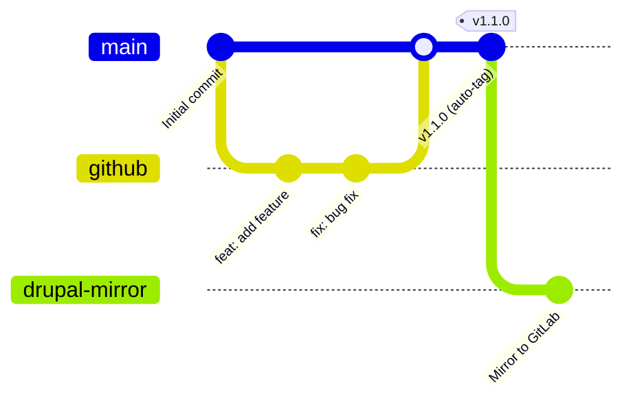

# 🚀 GitHub Contrib Template

A GitHub repository template for creating Drupal contrib modules with comprehensive testing infrastructure, code quality tools, and AI-friendly development environment. Because writing boilerplate is so last century! ✨

## 🎯 Quick Start

1. 🖱️ Click "Use this template" on GitHub to create a new repository
2. 📥 Clone your new repository locally
3. 🛠️ Follow the setup instructions below to customize for your module

## Setup Instructions

After creating a repository from this template, follow these steps:

### 1. Rename Files and References

Replace all instances of `gh_contrib_template` with your actual module name:

- Rename `gh_contrib_template.info.yml` to `your_module_name.info.yml`
- Update module name references in all files
- Update namespace references in PHP files
- Update test class names and namespaces

### 2. Install Git Hooks

After cloning, install the pre-commit hooks that will automatically check code quality:

```bash
npm install  # Installs husky and other dependencies
```

This sets up automatic git hooks for:

- **Pre-commit**: Code quality checks
  - PHP coding standards (Drupal/DrupalPractice)
  - PHPStan static analysis
  - JavaScript/CSS linting
  - Code formatting
- **Commit-msg**: Enforces [Conventional Commits](https://www.conventionalcommits.org/) format
  - Example: `feat: add user authentication`
  - Types: feat, fix, docs, style, refactor, perf, test, build, ci, chore, revert
- **Pre-push**: Validates branch naming ([Lullabot ADR](https://architecture.lullabot.com/adr/20220920-git-branch-naming/))
  - Format: `[ticket-id]--[description]`
  - Examples: `DRUPAL-123--fix-menu-bug`, `NOTICKET--update-readme`

### 3. Configure AI Assistant (Optional)

If you plan to use AI assistants for development:

- Rename `AGENTS.md` to match your preferred assistant (e.g., `CLAUDE.md`, `GEMINI.md`)
- Rename `tests/e2e/AGENTS.md` to match your preferred assistant (e.g., `CLAUDE.md`, `GEMINI.md`)
- Install the AI task manager:

```bash
npx @e0ipso/ai-task-manager init --assistants claude,gemini,opencode
```

### 4. Configure GitHub Actions Permissions

<details>
<summary>⚠️ <strong>Fix "Permission denied" errors in GitHub Actions</strong></summary>

#### Quick Fix

Go to your repository **Settings** → **Actions** → **General** → **Workflow permissions**:

- Select **Read and write permissions**
- Check **Allow GitHub Actions to create and approve pull requests**
- Click **Save**

#### Alternative: Personal Access Token

1. Create a [Personal Access Token](https://github.com/settings/tokens/new?scopes=repo,workflow) with `repo` and `workflow` scopes
2. Add it to your repository: **Settings** → **Secrets** → **Actions** → **New repository secret**
   - Name: `GH_TOKEN`
   - Value: Your token
3. Update `.github/workflows/release.yml`:
   ```yaml
   env:
     GITHUB_TOKEN: ${{ secrets.GH_TOKEN }}
   ```

#### Best Practice: Service Accounts

For team projects, use a dedicated bot account ([Lullabot ADR reference](https://architecture.lullabot.com/adr/20220426-use-dedicated-accounts-service-integrations/)):

- Create a bot GitHub account (e.g., `your-project-bot`)
- Add it as a collaborator with write permissions
- Use its PAT for automated workflows
- Benefits: Not tied to personal accounts, easier rotation, clear audit trail

</details>

### 5. Update Module Information

- Edit the `.info.yml` file with your module's details
- Update `composer.json` with your module's metadata
- Customize the module description and dependencies

> **Note**: This template is designed for modules hosted on GitHub with `vendor/module-name` namespacing (e.g., `lullabot/my-module`). For Drupal.org contrib modules requiring `drupal/module-name` namespacing, you can use GitHub Actions to mirror your repository to GitLab whenever new tags are created.

<details>
<summary><strong>📦 Publish to Packagist for Composer Installation</strong></summary>

To enable `composer require vendor/module-name` installation:

1. **Ensure your `composer.json` is properly configured** with:

- Correct `name` field (e.g., `"lullabot/my-module"`)
- `type: "drupal-module"`
- Proper `description` and `keywords`

2. **Submit to Packagist**:

- Visit [packagist.org](https://packagist.org)
- Click "Submit" and enter your GitHub repository URL
- Packagist will automatically sync with your repository

3. **Enable auto-updating**:

- Go to your package page on Packagist
- Click "Settings" → "GitHub Service Hook"
- This ensures new releases are automatically published

After submission, users can install your module with:

```bash
composer require vendor/module-name
```

**Note**: With semantic release enabled, your tags and releases are automatically created when you merge PRs with conventional commit messages (feat, fix, etc.).

</details>

<details>
<summary><strong>🔄 Mirror to Drupal.org for Official Contrib</strong></summary>

For official Drupal.org contrib modules requiring `drupal/module-name` namespacing, you can maintain your GitHub workflow while mirroring to GitLab:

**Overview**: Use GitHub Actions to automatically push new tags to your Drupal.org project repository at `https://git.drupalcode.org/project/module_name`.

**Requirements**:

- Approved Drupal.org project page
- SSH key or personal access token for GitLab authentication
- GitHub Action that triggers on new releases/tags



**Process Flow**:

1. **GitHub**: Developer workflow with PRs and semantic commits
2. **Auto-release**: Semantic Release creates tags automatically
3. **Mirror Action**: GitHub Action pushes code to `git.drupalcode.org`
4. **Manual Step**: Create release on Drupal.org project page using the mirrored tag

**Note**: While code mirroring can be automated, Drupal.org releases must be manually created through the project interface to generate the `drupal/module-name` Composer package.

</details>

### 6. Clean Up Example Files

- Delete `dummy.css` and `dummy.js` files - these are only included to demonstrate that the linting and code quality checks work correctly
- These files serve no functional purpose and should be removed once you've verified the linting works

## 🎁 Features Included

### 🧪 Testing Infrastructure

- **PHPUnit Test Suites**: Unit, Kernel, Functional, and FunctionalJavaScript tests
- **Trivial Test Examples**: Ready-to-adapt test templates for all test types
- **GitHub CI/CD**: Automated testing on pull requests and pushes
- **E2E Testing**: Playwright configuration for end-to-end testing

### 🔍 Code Quality Tools

- **PHPStan**: Static analysis configuration (`phpstan.neon`)
- **ESLint**: JavaScript linting (`.eslintrc.json`)
- **Prettier**: Code formatting (`.prettierrc.json`)
- **Pre-commit Hooks**: Automated code quality checks

### 🔧 Development Tools

- **GitHub Actions Workflows**:
  - `test.yml`: Comprehensive testing pipeline
  - `release.yml`: Release automation
- **Git Hooks**: Automated pre-commit checks via Husky
- **Node.js Integration**: Package management and frontend tooling
- **Git Configuration**: Proper `.gitignore` files for Drupal modules

### 🤖 AI-Friendly Configuration

- **AGENTS.md**: Instructions for AI assistants working on the project
- **Structured Documentation**: Clear patterns for AI to follow
- **Task Management Integration**: Ready for AI task orchestration

## 🧪 Testing

The template includes comprehensive testing infrastructure that'll make your tests run smoother than a freshly cached Drupal site! 🏃‍♂️

### PHPUnit Tests

```bash
# Run all tests
vendor/bin/phpunit

# Run specific test suites
vendor/bin/phpunit --testsuite=unit
vendor/bin/phpunit --testsuite=kernel
vendor/bin/phpunit --testsuite=functional
vendor/bin/phpunit --testsuite=functional-javascript
```

### Code Quality Checks

```bash
# Static analysis (let PHPStan judge your code so your colleagues don't have to)
vendor/bin/phpstan analyze

# Coding standards checks and fixes (because consistency is key 🔑)
composer run-script lint:check    # Check coding standards with PHPCS
composer run-script lint:fix      # Fix coding standards with PHPCBF

# JavaScript linting
npm run lint

# Code formatting
npm run format
```

### E2E Testing

<details>
<summary><strong>📦 E2E Dependencies Installation</strong></summary>

#### Prerequisites

- **Node.js**: Version 18.0.0 or higher
- **npm**: Installed with Node.js
- **Drupal Environment**: Running Drupal instance (local or remote)

#### Step-by-Step Installation

1. **Install Node.js Dependencies**

   ```bash
   # Install all npm dependencies (includes Playwright)
   npm ci
   ```

2. **Install Playwright Browsers**

   ```bash
   # Download and install browser binaries (Chromium, Firefox, WebKit)
   npm run e2e:install
   ```

   This command downloads approximately 300MB of browser binaries and may take a few minutes on first run.

3. **Verify Installation**

   ```bash
   # Check Playwright installation
   npx playwright --version

   # List installed browsers
   npx playwright install --dry-run
   ```

#### Troubleshooting Installation

**Permission Issues on Linux/macOS:**

```bash
sudo npx playwright install-deps
```

**Network/Firewall Issues:**

```bash
# Use alternative download method
PLAYWRIGHT_SKIP_BROWSER_DOWNLOAD=1 npm ci
npx playwright install chromium
```

**Disk Space Issues:**

- Playwright browsers require ~1GB disk space
- Use `npx playwright install chromium` to install only Chromium (smallest footprint)

</details>

#### Running Tests

```bash
# Run all tests
npm run e2e:test

# Run with browser UI (for debugging)
npm run e2e:test:headed

# Run in debug mode with step-by-step execution
npm run e2e:test:debug

# View test reports
npm run e2e:report
```

## 📁 Directory Structure

```
your_module_name/
├── .github/workflows/          # CI/CD pipelines
├── .claude/                   # AI assistant configuration
├── src/                       # PHP source code
├── tests/
│   ├── src/                   # PHPUnit tests
│   └── e2e/                   # Playwright E2E tests
├── config/                    # Configuration files
├── AGENTS.md                  # AI assistant instructions
├── composer.json              # PHP dependencies
├── package.json               # Node.js dependencies
├── phpstan.neon              # Static analysis config
└── your_module_name.info.yml  # Drupal module info
```

## ⚙️ GitHub Actions Integration

The template includes three main workflows:

- **Test Pipeline**: Runs on every PR and push, executing all test suites
- **AI Integration**: Supports AI-assisted development workflows
- **Release Automation**: Handles versioning and releases (see step 3 in setup for permissions)

<details>
<summary>Troubleshooting</summary>
If the <code>Tag</code> action for the semantic release job is failing because of missing GitHub permissions, then navigate to "Settings" → "Actions" → "General" → "Workflow permissions" and check <em>Read and write permissions</em> and <em>Allow GitHub Actions to create and approve pull requests</em>.
</details>
